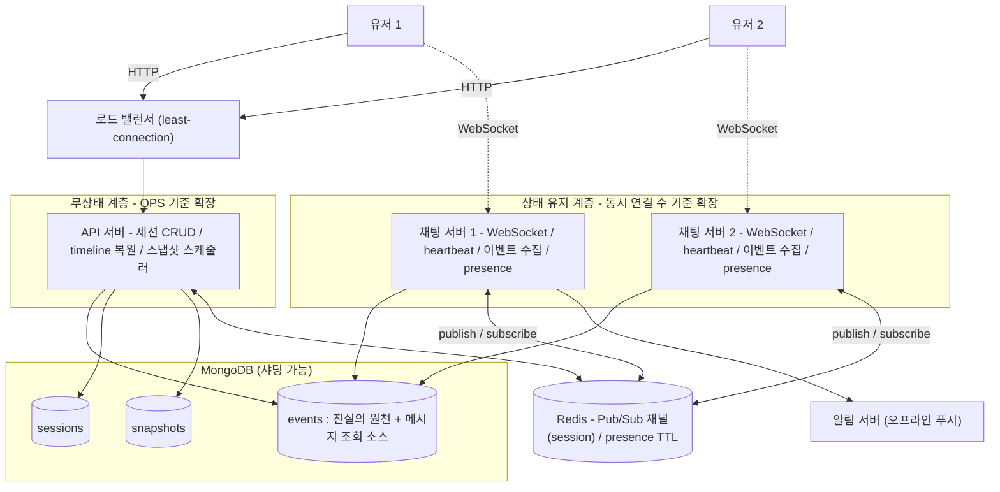
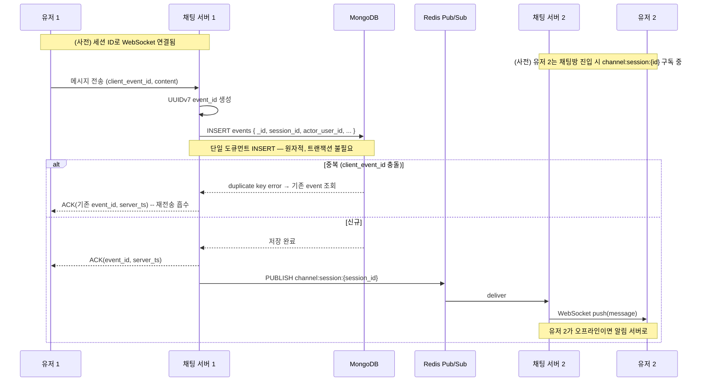

# 실시간 1:1 채팅 + 이벤트 소싱 기반 상태 복원 시스템 — 아키텍처 설계서

> 실시간 통신 + 이벤트 기반 상태 복원 기능
> 스택: Spring Boot · MongoDB · Redis · WebSocket(STOMP)

---

## 1. 개요와 설계 원칙

### 1.1 범위
1:1 참여자 간 실시간 채팅과, 대화 중 발생한 이벤트를 기반으로 한 특정 시점 상태 복원을 다룬다. 프론트엔드, 인증 체계 완결, 배포 자동화, 대형 그룹 채팅은 비목표다.

### 1.2 설계 원칙
1. **정당화되지 않는 컴포넌트는 넣지 않는다.** 각 컴포넌트는 "왜 존재하는가"에 한 문장으로 답할 수 있어야 한다.
2. **진실의 원천은 하나다.** 모든 정합성·복원 논리는 `events` 컬렉션 하나로 수렴한다.
3. **MongoDB를 골랐으면 MongoDB답게.** 멀티 컬렉션 트랜잭션에 의존하지 않고, 단일 도큐먼트 원자성 위에 설계한다.

| 검토했으나 채택하지 않은 것 | 뺀 이유 |
|---|---|
| Kafka (라이브 전달·파이프라인) | 라이브 전달용으로는 컨슈머 그룹의 분담 모델이 브로드캐스트 요구와 상반되고, 비동기 파이프라인용으로는 분리할 작업 자체가 없음(§2.4의 두 층 근거). §12에 도입 시점만 명시 |
| 별도 읽기 모델 컬렉션(`messages`) | 진실의 원천 `events`에서 `type` 인덱스로 메시지를 직접 조회. 별도 컬렉션을 두면 멀티 도큐먼트 트랜잭션이 필요해짐(§2.2) |
| Debezium / Outbox | MongoDB↔Kafka dual-write 도구. Kafka 자체를 뺐으므로 불필요 |
| 별도 ID 생성기 서비스 | UUIDv7을 챗 서버 인메모리에서 생성. 원격 호출·단일 장애점 회피 |
| 별도 Presence 서버 | WebSocket 연결 자체가 presence 신호. 연결을 가진 챗 서버가 직접 처리 |

남은 외부 시스템은 **MongoDB와 Redis 둘뿐**이다.

---

## 2. 기술 스택과 선택 근거

| 영역 | 선택 | 근거 |
|---|---|---|
| 실시간 전송 | WebSocket (STOMP) | 양방향 지속 연결. SSE는 단방향, long-polling은 비효율, WebRTC는 P2P라 서버 이벤트 영속화에 부적합 |
| 저장소 | MongoDB | 채팅 이벤트의 append-heavy 특성과 수평 샤딩 용이성(§2.1) |
| 메시지 ID | UUIDv7 | 시간 정렬 가능 + 인스턴스 간 조율 불필요(§2.3) |
| 라이브 전달 | Redis Pub/Sub | 채널 = `session_id`. 구독/발행 모델이 "수신자 위치를 몰라도 전달"을 해결(§5.3) |
| presence / 캐시 | Redis (TTL) | 휘발성 접속 상태에 적합 |

### 2.1 저장소 — 왜 MongoDB인가 (MySQL 대비)

채팅 이벤트는 끊임없이 쌓이는 append-heavy 데이터다. 진실의 원천 `events`는 시간이 지날수록 무한히 커진다. 이 워크로드에서 MongoDB가 갖는 실질 이점은 **수평 샤딩이 빌트인**이라는 점이다. shard key를 정하면 `mongos` 라우터가 분산·재배치(balancing)를 자동 처리한다. MySQL은 네이티브 샤딩이 없어 애플리케이션 레벨 라우팅이나 Vitess 같은 별도 계층이 필요하다.

| 기준 | MySQL | **MongoDB (채택)** |
|---|---|---|
| append-heavy 단일 노드 처리량 | 양호 (InnoDB redo log 순차 쓰기) | 양호 |
| 수평 샤딩 | 네이티브 미지원, 별도 계층 필요 | 빌트인 (`mongos` + shard key) |
| 가변 스키마 | JSON 컬럼 | 도큐먼트 모델에 자연 |
| 멀티 도큐먼트 트랜잭션 | 자연스러움 | 지원하나 샤딩 환경에서 비용 → §2.2로 회피 |

> **솔직한 트레이드오프**: MongoDB의 샤딩 이점은 데이터가 단일 노드 용량을 넘는 *대규모*에서 발동한다. 본 프로젝트 범위(1:1, 소규모)에서는 단일 인스턴스로 충분하므로 그 이점이 즉시 발동하지는 않는다. 그럼에도 MongoDB를 택하는 이유는 (1) 채팅 이벤트의 성장 특성상 확장 경로를 처음부터 단순하게 두는 것이 합리적이고, (2) §2.2의 단일 컬렉션 설계로 MongoDB의 약점(트랜잭션)을 회피할 수 있기 때문이다.

### 2.2 핵심 결정 — 진실의 원천 `events` 컬렉션 하나

이벤트 소싱에서 진실의 원천은 이벤트 로그 하나다. 흔히 읽기 모델(예: `messages`)을 별도 컬렉션으로 분리하지만, **본 설계는 별도 읽기 모델 컬렉션을 두지 않는다.** 메시지 목록이 필요하면 `events`에서 `type: "message_sent"`를 인덱스로 걸러 직접 조회한다.

이 결정의 이유는 MongoDB의 특성에 있다. MongoDB는 단일 도큐먼트 쓰기를 원자적으로 보장하지만, 여러 컬렉션에 걸친 트랜잭션은 가능하더라도 샤딩 환경에서 비용이 든다. 만약 `events`와 `messages`를 따로 두면 둘을 한 트랜잭션으로 묶어야 정합성이 보장되는데, 이는 "샤딩하려고 MongoDB를 골랐는데 트랜잭션 때문에 샤딩이 무거워지는" 모순을 낳는다.

`events` 컬렉션 하나로 통일하면 이벤트 수집이 **단일 도큐먼트 INSERT 하나**로 끝난다. 멀티 도큐먼트 트랜잭션이 원천적으로 필요 없다. 큐도, CDC도, Outbox도 필요 없다. 메시지 조회 성능은 `type` + `session_id` 인덱스로 확보한다(§7.3).

### 2.3 메시지 ID — 왜 UUIDv7인가 (Snowflake 대비)

UUIDv7과 Snowflake는 **둘 다 앞부분에 밀리초 타임스탬프를 담아 ID 자체로 시간순 정렬이 된다.** 이 점은 동등하다. 차이는 다른 축에서 갈린다.

| 기준 | Snowflake | **UUIDv7 (채택)** |
|---|---|---|
| 시간순 정렬 | 됨 | 됨 (동등) |
| 인스턴스 간 조율 | 워커ID를 인스턴스마다 유일하게 배분해야 함 | 불필요. 타임스탬프 뒤를 난수로 채움 |
| 표준·생태계 | 비표준, 직접 구현 | RFC 9562 표준 |
| MongoDB `_id` 적합성 | 가능 | 가능. 시간 정렬이라 `_id` 그대로 정렬 커서로 사용 |

Snowflake의 유일한 실질 장점은 64비트라는 작은 크기인데, 이는 대규모 인덱스 압박 상황에서 발동하는 이점이다. 워커ID 배분 부담은 규모와 무관하게 항상 발생한다. 발동하지 않는 장점을 위해 실재하는 비용을 지불하지 않는다 — UUIDv7을 채택한다. 메시지 ID 생성 위치는 메시지를 처음 받는 챗 서버의 인메모리다.

### 2.4 라이브 전달 — 왜 Redis Pub/Sub인가 (Kafka 대비)

Redis와 Kafka의 차이를 "실시간성 vs 확장성"으로 요약하는 것은 부정확하다. Kafka도 낮은 지연으로 대량 처리가 가능하다. 정확한 구분 축은 **메시지의 수명(lifetime)** 이다.

- **Redis Pub/Sub = 전달 통로**: 메시지를 저장하지 않는다. 발행하는 순간 그때 구독 중인 소켓에게 밀고 끝. 구독자가 없으면 사라진다.
- **Kafka = 영속 로그**: 메시지를 디스크에 보관하고, 소비자가 오프셋으로 "어디까지 읽었는지"를 추적하며, 죽었다 살아나도 그 지점부터 다시 읽는다.

라이브 전달은 *지금 연결된 상대에게 한 번 푸시*하면 끝나는 성격이고, 유실되어도 수신자가 재접속 시 MongoDB에서 복구한다(§9.3). 이는 "전달 통로"의 일이지 "영속 로그"의 일이 아니다. 그래서 Redis Pub/Sub이 맞다.

**Kafka를 시스템에서 통째로 배제한 근거는 두 층으로 나뉜다.**

*1층 — 라이브 전달용으로 부적합.* Kafka 컨슈머 그룹은 파티션을 멤버끼리 나눠 갖는 "작업 분담" 모델이다. 그런데 라이브 전달은 모든 채팅 서버가 전체 이벤트를 봐야 하는 "브로드캐스트"를 필요로 한다(누구에게 유저 2가 붙어 있을지 모르므로). 이 둘은 상반된다. 이는 Kafka의 결함이 아니라 — 분담하라고 만든 도구에 분담하면 안 되는 일을 시키는 오용이다. Kafka로 브로드캐스트를 하려면 채팅 서버마다 별도 컨슈머 그룹을 줘 각자 전체 파티션을 읽게 해야 하는데, 이는 "한 번만 특정 서버로 가면 되는" 요구를 "모든 서버가 받아 대부분 버리는" 비효율로 만든다. 반면 Redis 세션 채널 구독은 채팅 서버가 자기에게 붙은 세션의 채널만 구독하므로 이 낭비가 없다(§5.3).

*2층 — 비동기 파이프라인용으로도 불필요.* 위 1층은 "Kafka를 라이브 전달에 쓰면 안 되는 이유"일 뿐, "Kafka를 비동기 워커 용도로 남기지 않은 이유"는 아니다. 후자의 근거는 §12에 있다 — `events` 단일 컬렉션 + 단일 도큐먼트 INSERT 구조라 큐로 분리할 비동기 작업 자체가 없다. 라이브 전달엔 부적합하고, 비동기엔 쓸 데가 없어서, 결국 시스템에서 뺀다.

---

## 3. 핵심 설계 결정 요약

| # | 결정 | 트레이드오프 |
|---|---|---|
| D1 | MongoDB `events` 컬렉션 **하나**가 진실의 원천이자 메시지 조회 소스 | 멀티 도큐먼트 트랜잭션 불필요 ↔ 조회 시 `type` 필터 인덱스 의존 |
| D2 | 이벤트 수집 = **단일 도큐먼트 INSERT** | 원자성 자동 보장, 큐·CDC 불필요 ↔ — |
| D3 | 정렬·복원의 기준은 **UUIDv7 이벤트 ID** (서버 수신 순서) | 단순, 조율 불필요 ↔ 클라이언트 의도 순서와 어긋날 수 있음(§9.2) |
| D4 | 중복은 클라이언트 `client_event_id` + MongoDB **unique index**로 흡수 | 재전송이 안전 ↔ 클라이언트가 ID 생성 책임 |
| D5 | 라이브 전달은 Redis Pub/Sub, 채널 = `session_id` | 수신자 위치 추적 불필요 ↔ best-effort |
| D6 | 라이브 전달 유실 복구는 **전적으로 Pull 방식** (서버 측 스캔·재전송 없음) | 추가 컴포넌트 0 ↔ 복구가 클라이언트 재접속/주기 sync에 의존(§9.3) |
| D7 | 복원은 **스냅샷 + 이후 이벤트 결정론적 리플레이** | 복원 비용 상한 보장 ↔ 스냅샷 저장 비용 |
| D8 | 스냅샷은 **주기적 스케줄 배치**로 생성 | 큐·워커 불필요 ↔ 최신 스냅샷이 약간 과거일 수 있음(리플레이가 메움) |

---

## 4. 전체 아키텍처

시스템은 **무상태 계층(API 서버)**과 **상태 유지 계층(채팅 서버)**으로 나뉘고, 외부 서비스는 **MongoDB와 Redis** 둘이다. 한 문장으로 흐르는 동작은 이렇다 — 클라이언트는 세션 생성·복원 같은 일반 요청은 HTTP로 API 서버에, 실시간 메시지는 WebSocket으로 채팅 서버에 보낸다. 채팅 서버는 받은 이벤트를 MongoDB `events`에 저장(진실의 원천)하고, 같은 세션의 상대에게 전달하기 위해 Redis Pub/Sub의 세션 채널로 발행한다. 상대가 어느 채팅 서버에 붙어 있든 그 채널을 구독 중이므로 메시지를 받아 자기 WebSocket으로 push한다. 과거 시점 복원은 API 서버가 MongoDB의 스냅샷과 이벤트를 리플레이해 처리한다. 데이터 정합성의 모든 책임은 MongoDB `events`로 수렴하고, Redis는 휘발돼도 되는 것(전달 채널·presence)만 담당한다.



### 4.1 컴포넌트 역할

| 컴포넌트 | 상태성 | 역할 |
|---|---|---|
| API 서버 | 무상태 | 세션 생성/종료/목록, 특정 시점 복원(timeline), 스냅샷 스케줄러 |
| 채팅 서버 | 상태 유지 | WebSocket 연결·heartbeat, 이벤트 수집→MongoDB 저장→ACK, Redis Pub/Sub 발행·구독, presence 관리 |
| MongoDB | — | `events`(진실의 원천), `sessions`, `snapshots` |
| Redis | — | 세션별 Pub/Sub 채널(라이브 전달), presence(TTL) |

> **Presence를 별도 서버로 두지 않은 이유**: 사용자의 접속 여부는 곧 "WebSocket이 살아있는가"이고, 그 연결을 보유한 주체가 채팅 서버다. 책 12장은 presence를 별도 서버로 분리하나 그것은 대규모 설계이며, 본 프로젝트 범위에서는 불필요한 분리다.

### 4.2 모듈 구성 및 실행 환경

본 시스템은 **멀티모듈 프로젝트**로 구성한다. API 서버와 채팅 서버는 무상태 계층/상태 유지 계층으로 성질이 다르고 독립적으로 확장되므로(§3, §5.1), 빌드·배포 단위도 모듈로 분리한다.

| 모듈 | 역할 | 인스턴스 수 |
|---|---|---|
| `api-server` | 무상태 — 세션 CRUD, timeline 복원, 스냅샷 스케줄러(§12.3) | 1 (단순 증설 가능) |
| `chat-server` | 상태 유지 — WebSocket·이벤트 수집·라이브 전달·presence | **여러 개** (수평 확장의 핵심 단위) |
| `common` (선택) | 두 모듈이 공유하는 도메인 모델·이벤트 정의·DTO | 라이브러리 모듈 |

`chat-server`가 여러 개로 떠야 한다는 것이 이 구성의 핵심이다 — 라이브 전달이 "서로 다른 채팅 서버에 붙은 두 유저"를 전제로 설계됐기 때문이다(§5.3). 채팅 서버가 한 대뿐이면 그 시나리오가 검증되지 않는다.

**Docker Compose 구성** — 로컬에서 다음을 함께 띄운다.

| 서비스 | 설명 |
|---|---|
| `api-server` | API 서버 1대 |
| `chat-server-1` | 채팅 서버 인스턴스 1 |
| `chat-server-2` | 채팅 서버 인스턴스 2 |
| `mongodb` | 외부 서비스 — 진실의 원천 |
| `redis` | 외부 서비스 — Pub/Sub 채널, presence |

**채팅 서버를 2개 띄우는 이유** — "유저 1은 `chat-server-1`에, 유저 2는 `chat-server-2`에 붙은" 상황을 로컬에서 그대로 재현하기 위해서다. 두 인스턴스가 같은 Redis 세션 채널로 메시지를 주고받는 §5.3의 동작, 그리고 한 채팅 서버가 죽었을 때의 복구(§15.1)를 실제로 검증할 수 있다.

**알림 서버·로드 밸런서는 Docker Compose에 포함하지 않는다.** 알림 서버(오프라인 푸시)는 본 프로젝트 범위 밖이라 설계 다이어그램에만 두고 실제로 띄우지 않으며, 오프라인 수신자 처리는 "MongoDB에 저장 후 Pull 복구"(§9.3)로 충분히 검증된다. 로드 밸런서는 §5.2에서 정한 대로 인프라 계층이라 구현 대상이 아니다 — 로컬에서는 클라이언트가 `chat-server-1` 또는 `chat-server-2`에 직접 접속해 다중 서버 시나리오를 재현한다. 마찬가지로 **Redis Sentinel HA 구성도 로컬 Compose에 포함하지 않는다** — Sentinel은 운영 환경의 가용성 설계이며(§15.4), 로컬에는 단일 `redis`만 둔다. 이 셋은 모두 "설명은 하되 로컬에 띄우지 않는" 컴포넌트다.

외부 서비스는 **MongoDB와 Redis 둘뿐**이며(§1.2), Docker Compose 한 번으로 전체 환경이 구동된다.

---

## 5. 통신 계층

### 5.1 API 서버와 채팅 서버의 경계

통신은 시간순으로 두 단계로 갈린다.

**연결 맺기 전 (HTTP, API 서버 경유)** — 로그인·인증, 세션 생성. 요청-응답 한 번으로 끝나는 일이라 일반 HTTP가 맞다. WebSocket 연결 자체는 로드 밸런서가 살아있는 채팅 서버로 분배한다(§5.2).

**연결 맺은 후 (WebSocket, 채팅 서버 직결)** — 메시지 송신·수신, heartbeat. 클라이언트는 추천받은 채팅 서버와 WebSocket을 맺고, 이후 메시지는 **API 서버를 거치지 않고** 그 지속 연결로 채팅 서버와 직접 주고받는다.

단, 메시지 송수신과 무관한 일 — 세션 목록 조회, 특정 시점 복원 `GET /sessions/{id}/timeline` — 은 일반 조회이므로 여전히 HTTP로 API 서버가 처리한다. 한 클라이언트가 채팅 서버와 WebSocket을, API 서버와 HTTP를 동시에 들고 있는 것이 정상이다.

### 5.2 신규 연결 분배 — 로드밸런싱과 서비스 디스커버리

WebSocket은 한 번 맺으면 오래 유지되는 연결이므로, 신규 접속을 어느 채팅 서버로 보낼지 정하는 메커니즘이 필요하다. 이 항목은 인프라 계층이라 구현 대상이 아니며, 아래 세 안을 검토해 설계 문서로 결정을 기술한다.

**개념 정리** — 로드밸런싱과 서비스 디스커버리는 대립하는 두 방식이 아니다. 디스커버리는 *"채팅 서버가 지금 어디에 몇 대 살아있나"*(후보 목록과 생사)에 답하고, 로드밸런싱은 *"그 후보 중 이 연결을 어디로 보낼까"*(분배 결정)에 답한다. 로드밸런싱을 하려면 후보를 알아야 하므로, 로드밸런서 안에는 어떤 형태로든(헬스체크 등) 디스커버리가 포함된다. 따라서 진짜 쟁점은 "디스커버리냐 로드밸런싱이냐"가 아니라 **분배를 무엇을 근거로 하느냐**다.

| 안 | 분배 근거 | 별도 계층 | 평가 |
|---|---|---|---|
| **A. L4 로드밸런서 라운드로빈** | 순번 | 없음 | 동작하나, WebSocket의 연결 수 편향을 못 잡음(아래) |
| **B. L4 로드밸런서 least-connection** | LB가 보는 활성 연결 수 | 없음 | A의 편향 문제를 해결. LB 기본 기능으로 추가 구현 0 |
| **C. Redis 레지스트리 + API 서버 선택** | 채팅 서버가 보고한 `conn_count` | 있음 (Redis 레지스트리) | 가장 정밀하나 본 프로젝트 범위엔 과함 |

**A의 한계 — 라운드로빈은 연결 수 편향을 못 잡는다.** 라운드로빈은 일반 HTTP(짧은 요청)에는 완벽하지만, WebSocket은 *연결*이고 오래 산다. 라운드로빈은 "연결을 맺는 순간"만 고르게 나누고 그 이후의 현재 연결 수는 보지 않는다. 예컨대 채팅 서버 한 대가 잠깐 죽었다 살아나면 그 서버의 연결들이 다른 서버로 재분배되어 편향이 생기는데, 라운드로빈은 살아난 서버가 비어 있는 것을 모른 채 계속 순번대로 분배한다 — "연결 맺는 횟수"는 고르지만 "현재 연결 수"는 어긋난다.

**C의 검토 — 현 범위엔 과설계.** C는 채팅 서버가 Redis에 `{host, port, conn_count}`를 TTL과 함께 등록하고 API 서버가 `conn_count`가 가장 낮은 서버를 골라 endpoint를 반환하는 방식이다. L4 LB가 세는 "TCP 연결 수"보다 채팅 서버가 직접 아는 "실제 활성 WebSocket 세션 수"가 더 정확하다는 이점은 있다. 그러나 신규 연결 분배 자체는 B로도 충분히 해결되며, C는 별도 레지스트리 계층과 그 정합성 관리를 추가로 떠안는다. 1:1·소규모 범위에서 연결 편향은 수십 개 단위라 이 정밀도 차이가 실질적으로 발동하지 않는다.

**결정 — B(로드밸런서 least-connection)를 채택한다.** least-connection은 nginx·HAProxy·클라우드 LB가 기본 제공하는 모드이므로, 별도 코드나 Redis 키 없이 라운드로빈(A)의 연결 수 편향 문제까지 해결된다. 이는 본 설계의 일관된 원칙(규모에서 발동하지 않는 최적화를 미리 하지 않는다 — Kafka·Snowflake·인스턴스 단위 채널과 동일)에 부합한다.

**전환 지점** — 채팅 서버별 *활성 WebSocket 세션 수*를 애플리케이션 레벨 지표로 더 정밀하게 보고 분배해야 하거나, 그 지표를 관측·운영에도 함께 활용할 필요가 생기면 C(Redis 레지스트리 기반 디스커버리)로 전환한다. 그 경우 채팅 서버가 `conn_count`를 TTL과 함께 Redis에 등록하고, 이 레지스트리 키의 만료를 서버 생사 판정에도 함께 활용한다.

> **분배는 "추천"이지 "사실"이 아니다.** 어떤 안을 쓰든 신규 연결 분배는 "접속할 서버를 정해줄" 뿐, "이미 접속한 유저 2가 지금 어느 서버에 있는지"는 답하지 않는다. 유저 2에게 메시지를 전달하는 문제는 §5.3의 Pub/Sub이 별도로 푼다.

### 5.3 라이브 전달 — 세션 채널 구독/발행

#### 동작

Redis Pub/Sub의 채널을 사용자나 서버가 아니라 **`session_id`로** 잡는다.

- 유저 2가 어느 채팅 서버에 접속해 채팅방에 들어가면, 그 서버가 Redis 채널 `channel:session:{sessionId}`를 **구독**한다.
- 유저 1이 메시지를 보내면, 유저 1의 채팅 서버는 MongoDB에 저장한 뒤 같은 채널에 **발행**한다.
- 그 채널을 구독 중인 서버(= 유저 2가 붙은 서버)가 메시지를 받아 유저 2의 WebSocket으로 즉시 푸시한다.

핵심은 **유저 1의 서버가 "유저 2가 어느 서버에 있는지" 알 필요가 없다**는 점이다. 두 유저가 서로 다른 채팅 서버(서버 1, 서버 2)에 나뉘어 붙어 있어도, `session_id`가 같으면 같은 채널을 통해 연결된다 — 서버 1이 `channel:session:{id}`에 발행하고 서버 2가 그 채널을 구독 중이기 때문이다. 세션 채널에 던지면 유저 2가 붙은 서버가 자기가 구독한 채널로 받는다. 별도 라우팅 테이블도, 모든 서버에 뿌리는 브로드캐스트도 필요 없다. 구독/발행 모델 자체가 "위치를 모르고도 전달"을 해결하며, 채팅 서버들은 서로의 존재를 몰라도 된다.

Redis Pub/Sub은 메시지가 휘발성이라 발행 순간 구독자가 없으면 사라진다. 이는 best-effort이며, 복구는 §9.3의 Pull 방식이 담당한다.

#### 채널을 세션 단위로 잡아도 되는가 — "수백만 채널" 우려에 대한 답

세션마다 채널을 만들면 동시 활성 세션 수만큼 채널이 생긴다. "채널이 수십만~수백만 개가 되어도 괜찮은가"라는 의문이 자연스럽게 든다. 이 우려는 **대상이 잘못되었다.** Redis 채널과 Kafka 토픽은 같은 단어처럼 보이지만 근본적으로 다른 물건이다.

| | Kafka 토픽 | Redis Pub/Sub 채널 |
|---|---|---|
| 실체 | **물리적**. 디스크 로그 세그먼트, 파티션별 파일 핸들·메모리·복제 스레드 | **비물리적**. 구독자 목록을 담은 키 하나일 뿐 |
| 생성 | 명시적으로 만들어야 함 | "만드는" 행위가 없음. 누가 `SUBSCRIBE` 하는 순간 생기고, 마지막 구독자가 나가면 흔적 없이 사라짐 |
| 빈 토픽/채널 | 디스크·메타데이터를 점유 | 존재 자체를 안 함 |

따라서 Kafka에서 토픽 수백만 개는 재앙(파일 핸들 고갈, 메타데이터 폭발)이지만, **Redis에서 채널 수는 "동시에 누가 구독 중인 세션의 수"만큼만 존재하며, 각 채널은 구독자 목록 하나라 가볍다.** 전체 세션이 수백만 개라도 지금 두 사람이 다 접속해 대화 중인 방이 5만 개면 채널은 5만 개다. 채널 개수 자체는 이 설계의 병목이 아니다.

#### 진짜 약점 — Redis Pub/Sub의 수평 확장 한계

채널 개수가 아니라 다음 두 가지가 실제 비용이다.

1. **단일 노드 fan-out 병목**: Redis Pub/Sub은 한 노드 안에서 동작한다. 채팅 서버가 N대라면 N대 전부가 같은 Redis에 연결해 발행·구독해야 메시지가 서로 닿는다. 즉 Redis 한 대가 모든 채팅 트래픽의 fan-out 허브가 되어 단일 병목이 된다. Redis Cluster를 써도 일반 Pub/Sub은 메시지를 전 노드에 전파해버려 샤딩 이점이 적용되지 않는다(이 때문에 Redis 7.0이 샤드 한정 `SSUBSCRIBE`를 별도로 추가했다). **이것이 Redis Pub/Sub 채팅의 진짜 한계다.**
2. **구독 생명주기 관리 책임**: 유저가 방에 들어오면 `SUBSCRIBE`, 나가면 `UNSUBSCRIBE`. 이 생명주기를 채팅 서버가 정확히 관리해야 하며, 누락되면 죽은 구독이 새거나 엉뚱한 메시지를 받는다.

#### 검토한 대안 — 서버 인스턴스 단위 채널 + 라우팅 테이블

세션 단위 채널의 대안으로 **서버 인스턴스 단위 채널**을 검토했다. 채널을 `channel:chatserver-3`처럼 채팅 서버 인스턴스 단위로 잡고, "유저 B는 chatserver-3에 있다"는 매핑을 Redis에 별도 저장(연결 라우팅 테이블)한 뒤, 발행 측이 그 매핑을 조회해 대상 서버 채널로 보내는 방식이다.

| | 방(세션) 단위 채널 — **본 설계 채택** | 서버 인스턴스 단위 채널 — 검토 후 미채택 |
|---|---|---|
| 채널 수 | 동시 활성 세션 수 (많으나 가벼움) | 채팅 서버 수 (적음) |
| 라우팅 테이블 | 불필요 (채널이 곧 라우팅) | 필요 (유저→서버 매핑, stale 관리 부담) |
| 발행 측 로직 | `PUBLISH channel:session:{id}` 한 줄 | Redis 조회 후 대상 서버 채널로 발행 |
| 직관성 | 높음 | 낮음 |
| 적합 규모 | 소~중 (본 프로젝트 포함) | 대규모 (수십만+ 동시 활성 세션) |

**미채택 판단(과설계).** 인스턴스 단위 채널이 푸는 문제는 "세션 채널이 너무 많아지는 것"인데, 앞서 보았듯 Redis 채널은 가벼워 개수 자체가 병목이 아니다 — 즉 *발생하지 않는 문제*를 푼다. 그 대가로 유저→서버 매핑 테이블을 새로 떠안는다. 이 테이블은 stale 관리가 필요하다: 유저가 끊기면 누가 지우나, 서버가 죽으면 그 서버의 모든 매핑이 stale이 되어 그 윈도우 동안 죽은 서버 채널로 발행하게 된다. 세션 채널의 `PUBLISH session:{id}` 한 줄이 "Redis 조회 → 대상 서버 채널 발행 → stale 처리"의 stateful 로직으로 바뀐다. 현 범위에서 채널 수는 문제가 아니므로 줄여서 얻는 것이 없고 관리 부담만 늘어난다 — Kafka·Snowflake를 미채택한 것과 동일한 원칙(규모에서 발동하지 않는 최적화를 미리 하지 않는다)이다.

**전환 지점.** 인스턴스 단위 채널은 동시 활성 세션이 수십만을 넘어 그 수만큼의 채널 구독이 단일 Redis 노드의 메모리·연결을 실제로 압박할 때 정당해진다. 그 시점에 채널을 인스턴스 단위로 바꾸고 라우팅 테이블을 도입한다 — 지금이 아니라.

---

## 6. 이벤트 소싱 모델

### 6.1 개념
상태(state)를 저장하는 대신 **상태를 만들어낸 사건(event)들의 불변 시퀀스**를 저장한다. 현재 상태는 이벤트를 순서대로 적용(fold)해 계산하고, 일부 이벤트까지만 적용하면 과거 시점의 상태가 된다 — 이것이 "특정 시점 복원"의 메커니즘이다.

`events` 컬렉션은 append-only다. INSERT만 하고 도큐먼트를 수정·삭제하지 않는다. 메시지 수정·삭제조차 기존 도큐먼트를 고치는 게 아니라 `message_edited`/`message_deleted` 이벤트를 새로 추가한다.

### 6.2 영속 이벤트 카탈로그

| type | 발생 시점 | payload 주요 필드 | 복원 시 효과 |
|---|---|---|---|
| `session_created` | 세션 생성 | `created_by` | 빈 세션 초기화 |
| `participant_joined` | 참여 | `user_id` | 참여자 목록에 추가 |
| `participant_left` | 퇴장 | `user_id` | 참여자 목록에서 제거 |
| `message_sent` | 메시지 송신 | `content` | 메시지 목록에 추가 |
| `message_edited` | 메시지 수정 | `target_event_id`, `content` | 해당 메시지 본문 갱신 |
| `message_deleted` | 메시지 삭제 | `target_event_id` | 해당 메시지 soft-delete |
| `session_ended` | 종료 | `ended_by` | 세션 상태 → ended |

> **connect/disconnect는 영속 이벤트로 두지 않는다.** 접속 상태는 본질적으로 휘발적이고, 네트워크가 불안정하면 재연결이 폭주해 append-only 로그를 오염시킨다. presence는 Redis TTL로 다루며 `events`에 쌓지 않는다. 복원 대상인 "참여자 목록"은 멤버십 이벤트(`participant_joined`/`left`)로 충분히 표현된다.

---

## 7. 데이터 모델 (MongoDB)

### 7.1 컬렉션 구성

세 개의 컬렉션만 둔다. `events`가 진실의 원천이자 메시지 조회 소스이고, 별도 읽기 모델 컬렉션은 없다(D1).

```
events      : 모든 이벤트. append-only. 메시지 조회도 여기서.
sessions    : 세션 메타데이터(상태, 생성자). 작은 컬렉션.
snapshots   : 복원 최적화용 체크포인트.
```

### 7.2 도큐먼트 구조

```javascript
// events — 진실의 원천. _id 는 UUIDv7(시간 정렬).
{
  _id:             UUID("..."),         // UUIDv7, 정렬·복원·커서의 기준
  session_id:      UUID("..."),
  type:            "message_sent",
  actor_user_id:   "user-1",
  client_event_id: UUID("..."),         // 클라이언트 생성 멱등 키
  payload:         { content: "안녕하세요" },
  client_ts:       ISODate("..."),      // 참고용, 신뢰하지 않음
  server_ts:       ISODate("...")       // 서버 수신 시각
}

// sessions
{
  _id:        UUID("..."),
  status:     "active",                 // active | interrupted | ended
  created_by: "user-1",
  created_at: ISODate("..."),
  ended_at:   null
}

// snapshots — 복원 출발점.
{
  _id:            UUID("..."),
  session_id:     UUID("..."),
  up_to_event_id: UUID("..."),          // 이 이벤트까지 반영된 상태
  state:          { participants: [...], messages: [...], status: "active" },
  snapshot_at:    ISODate("...")
}
```

### 7.3 인덱스 설계 (핫패스 중심)

| 인덱스 | 대상 쿼리 | 근거 |
|---|---|---|
| `events { session_id: 1, _id: 1 }` | 재연결 증분 동기화, 시점 복원 리플레이, 메시지 목록 조회 | 세션 단위 범위 스캔을 정렬된 순서로. UUIDv7이라 `_id` 정렬 = 시간 정렬 |
| `events { session_id: 1, client_event_id: 1 }` *unique* | 중복 이벤트 차단 | 멱등 INSERT 시 충돌 감지 |
| `events { session_id: 1, type: 1, _id: 1 }` | 메시지만 골라 최근 N개 조회 | 별도 `messages` 컬렉션 없이 `type` 필터로 메시지 추출 |
| `events { session_id: 1, server_ts: 1 }` | `timeline?at=` 시간 필터 | `at` 이전 이벤트를 시간으로 끊음 |
| `snapshots { session_id: 1, up_to_event_id: -1 }` | 복원 시 가장 가까운 스냅샷 | 세션별 최신 스냅샷 즉시 획득 |

> **샤딩 전략**: `events`의 shard key는 **`session_id`**로 한다. (1) 한 세션의 모든 이벤트가 같은 샤드에 모여 세션 단위 조회·복원이 단일 샤드에서 끝나고(scatter-gather 회피), (2) 세션이 많아지면 자연히 여러 샤드로 분산된다. 단일 세션이 비대해지는 hot shard가 우려되면 `{ session_id, _id }` 복합 키로 같은 세션도 분할할 수 있으나, 1:1 채팅은 세션당 트래픽이 제한적이라 `session_id` 단일 키로 충분하다.

---

## 8. 핵심 데이터 흐름

### 8.1 메시지 송신

세션 ID는 이미 보유한 상태로 가정한다.



**데이터의 시작점은 MongoDB에 저장된 시점이다.** ACK는 "MongoDB에 저장됐다"는 의미이며, "상대가 봤다"는 의미가 아니다. MongoDB 저장 성공 이후의 Redis 발행은 best-effort다 — 유실되어도 §9.3의 Pull 복구가 메운다.

### 8.2 사용자 join / leave 처리

join과 leave도 메시지와 동일하게 **이벤트로 처리**된다 — `participant_joined` / `participant_left`를 `events` 컬렉션에 INSERT하고, 같은 세션 채널로 발행해 상대에게 알린다. 메시지 송신(8.1)과 같은 멱등·정렬·전달 경로를 그대로 탄다.

**join 흐름**:
1. 유저가 채팅방 진입을 요청(WebSocket 연결 후 STOMP SUBSCRIBE, 또는 `POST /sessions/{id}/join`).
2. 채팅 서버가 `participant_joined` 이벤트를 생성 — UUIDv7 `_id`, `client_event_id`(멱등 키).
3. `events`에 INSERT. **재진입(이미 참여 중인 유저가 재연결로 다시 join)** 은 `client_event_id` unique index가 흡수하거나, 애플리케이션이 "이미 active participant면 새 이벤트를 만들지 않음"으로 처리한다 — join은 멱등해야 한다.
4. 채팅 서버가 `channel:session:{id}`를 `SUBSCRIBE`(라이브 전달 준비, §5.3).
5. 같은 채널에 `participant_joined`를 발행 → 상대가 참여자 입장을 인지.

**leave 흐름**:
1. 유저가 퇴장을 요청(`POST /sessions/{id}/end`의 일부, 또는 명시적 leave).
2. `participant_left` 이벤트를 `events`에 INSERT.
3. 채팅 서버가 해당 세션 채널 구독을 해제(`UNSUBSCRIBE`)할지 판단 — 그 서버에 해당 세션의 다른 연결이 없으면 해제.
4. `participant_left`를 채널에 발행 → 상대가 퇴장을 인지.

> **leave와 disconnect는 다르다.** `participant_left`는 "세션에서 나간다"는 영속적 멤버십 종료이고 `events`에 남는다. 반면 WebSocket 연결이 네트워크 문제로 끊긴 것은 멤버십 종료가 아니라 일시적 단절이며, 이는 presence(§8.3)로만 다루고 `events`에 남기지 않는다(6.2절 참조). 복원 시 참여자 목록은 `participant_joined`/`left`만으로 계산된다.

### 8.3 presence 처리 — 세션 참여/접속 상태

**범위 결정 — "세션 참여/접속 상태"로 한정한다.** presence는 "online/offline" 방식과 "세션 참여 상태" 방식으로 나눠 생각할 수 있다. 둘 중 본 설계는 **세션 참여/접속 상태**를 택한다.

유저 전역 online/offline("이 사용자가 서버에 접속해 있는가", 세션과 무관)을 추적하려면 친구 목록 전체에 대한 presence와 fan-out 구조가 필요하다 — 1:1 채팅 범위를 넘는 과설계다. 본 설계가 다루는 presence는 "이 세션의 상대가 *지금 이 방에 접속해 화면을 보고 있는가*"로 한정한다. 1:1 채팅에서 알고 싶은 presence는 상대 한 명에 대한 것뿐이므로 세션 범위로 충분하고 fan-out이 필요 없다.

**세 가지 상태.** 한 세션 안에서 상대의 상태는 셋으로 구분된다.

| 상태 | 판정 | 의미 |
|---|---|---|
| 접속 중 | `participants.left_at IS NULL` + WebSocket 연결 살아있음 + presence 키 존재 | 멤버이고 지금 이 방을 보고 있음 |
| 멤버지만 끊김 | `left_at IS NULL` + presence 키 없음 | 멤버십은 유지, 네트워크 단절·앱 종료로 일시 단절(§6.2·8.2) |
| 세션 떠남 | `participant_left` 이벤트 발생(`left_at` 기록) | 명시적 leave/end로 멤버십 종료 |

세션 멤버십(`participants`)과 접속 여부(presence)는 독립적이다 — 멤버이면서 끊겨 있을 수 있다. 복원(§10)의 참여자 목록은 멤버십(`participant_joined`/`left`) 기준이며, presence는 정합성에 관여하지 않는 **순수 표시용**이다.

**heartbeat 기반 판정** — 책 12장의 heartbeat 방식을 채택한다.
1. 클라이언트는 WebSocket을 통해 일정 주기(예: 10초)로 heartbeat를 보낸다. STOMP 프로토콜 레벨 heartbeat를 활용하므로 별도 메시지가 필요 없다.
2. 채팅 서버는 heartbeat를 받을 때마다 Redis 키를 갱신한다. 키는 세션 범위로 잡는다 — `presence:{session_id}:{user_id}`, 값 `online`, TTL은 heartbeat 주기보다 길게(예: 30초). `SET presence:{session_id}:{user_id} online EX 30`. 한 유저가 세션마다 접속 상태가 다를 수 있으므로 키를 세션 단위로 둔다.
3. 비정상 단절(앱 강제 종료·네트워크 단절)로 heartbeat가 멈추면 TTL이 만료되어 키가 자동 소멸한다 → 키 부재 = "끊김". 명시적 처리 없이도 끊김 판정이 된다(약 30초 지연은 수용 가능한 절충).
4. 명시적 leave/end 시에는 키를 즉시 삭제해 지연 없이 처리한다.

**저장(A)과 전파(B)는 별개 동작이다.**

- *동작 A — 저장*: `presence:{session_id}:{user_id}` 키를 Redis에 쓰고 TTL을 건다. Redis의 **일반 키-값 저장**이며, 상태를 *보관*할 뿐 누구에게도 알림을 보내지 않는다.
- *동작 B — 전파*: 상태가 바뀌었다는 사실을 상대에게 push한다. 키-값 저장이 아니라 **Redis Pub/Sub**이며, A와 별개로 코드가 명시적으로 수행해야 한다. **키를 `SET`하는 것이 전파를 자동으로 일으키지 않는다.**

`presence:{session_id}:{user_id}`(키-값 저장)와 `channel:session:{id}`(Pub/Sub 채널)는 둘 다 Redis지만 다른 메커니즘이다 — 전자는 보관, 후자는 전달. 전파(B)에 `presence:` 키가 등장하지 않는 이유다. 전파 통로로는 **세션 채널 `channel:session:{id}`를 재사용**한다 — 상태 변경을 알아야 하는 대상이 "같은 세션의 상대"로 메시지 전달(§5.3)과 같은 목적지이기 때문이다. 별도 presence 채널을 두면 상대가 채널을 둘 구독해야 하므로, 세션 채널 하나로 그 세션의 모든 라이브 이벤트(메시지·join·leave·presence)를 흘려보낸다.

**발행 주체** — 상태가 변경된 유저가 접속한 채팅 서버가 A와 B를 모두 수행한다. 유저 1이 채팅 서버 A에 접속하면, A가 키를 저장하고 **이어서 A가** `channel:session:{id}`에 발행한다. 유저 2가 붙은 채팅 서버 B는 그 채널을 *구독*하다가 받아서 유저 2에게 push할 뿐 — B는 발행하지 않는다. 발행은 "사건을 아는 서버", 구독·수신은 "상대를 들고 있는 서버"가 한다(§8.1 메시지 송신과 동일 원칙).

**접속·명시적 leave는 능동 전파, 비정상 단절은 수동 인지** — 두 경로가 다르다.

- *접속 / 명시적 leave·end*: *행위*가 있으므로 그 서버가 A+B를 즉시 수행해 능동 전파한다. 상대는 즉시 push로 받는다.
- *비정상 단절(네트워크 에러·앱 강제 종료)*: 유저가 그냥 사라진 것이라 "끊겼다"고 발행해 줄 주체가 없다 — 끊긴 유저 본인도, 그 서버도, Redis도(키는 조용히 만료될 뿐 만료를 알리지 않음) 전파할 수 없다. 따라서 이 경우는 push되지 않고, **상대가 조회할 때 수동으로 인지**한다 — 유저 1이 채팅방에 (재)진입하거나 주기적으로 `presence:{session_id}:user-2`를 확인할 때 "키 없음 = 끊김"으로 판정한다.

> **솔직한 한계와 그 수용 근거.** 비정상 단절은 능동 전파가 불가능하므로, 상대가 재진입·폴링하기 전까지는 끊김을 모를 수 있다 — 화면에 "접속 중"으로 잘못 남아 있을 수 있다. 그러나 이 한계는 치명적이지 않다. presence가 틀려도 유저 1이 보낸 메시지는 MongoDB에 저장되고 유저 2가 재접속 시 resume으로 받는다(§9.3) — **presence 오류의 피해는 "상대가 보고 있는 줄 알았다"는 기대 어긋남뿐이고, 데이터 정합성에는 영향이 0이다.** presence는 어떤 정합성 결정에도 관여하지 않는 순수 표시용 정보이기 때문에, 30초 지연·비정상 단절 미인지 같은 부정확성이 수용 가능하다. 책 12장의 heartbeat presence가 "약간의 지연이 있지만 현실적인 절충"이라 한 것과 같은 판단이다.

### 8.4 WebSocket 메시지 스펙 (STOMP)

실시간 송수신은 STOMP destination으로 구분한다. 클라이언트와 채팅 서버 간 계약은 다음과 같다.

| 방향 | destination / 프레임 | 페이로드 | 설명 |
|---|---|---|---|
| 클라이언트 → 서버 | `SEND /app/sessions/{id}/messages` | `{ client_event_id, content }` | 메시지 송신 |
| 서버 → 클라이언트 | `SUBSCRIBE /topic/sessions/{id}` | 이벤트 객체 | 해당 세션의 라이브 이벤트 수신(메시지·join·leave·presence) |
| 서버 → 송신자 | `SEND /user/queue/ack` | `{ client_event_id, event_id, server_ts }` | 송신 ACK(멱등) |
| 클라이언트 → 서버 | `SEND /app/sessions/{id}/resume` | `{ last_event_id }` | 재연결 시 누락분 요청(§9.3) |
| heartbeat | STOMP 프로토콜 heartbeat | — | presence 갱신(§8.3) |

채팅 서버는 `/topic/sessions/{id}` 구독을 받으면 내부적으로 Redis `channel:session:{id}`를 `SUBSCRIBE`하고, Redis에서 받은 이벤트를 그 STOMP destination으로 중계한다 — STOMP destination과 Redis 채널이 세션 단위로 1:1 대응한다.

### 8.5 WebSocket 연결 관리

채팅 서버는 자기에게 붙은 WebSocket 연결을 인메모리로 추적한다. 이 연결 테이블은 §15.1·§15.4의 장애 복구가 전제하는 핵심 자료구조다.

**무엇을 조회하는가 — 접근 패턴이 자료구조를 결정한다**

연결 테이블로 하는 일은 세 가지다. (1) Redis 채널에서 세션 이벤트가 도착했을 때 → 그 세션에 속한 이 서버의 WebSocket을 찾아 push(가장 잦은 핫패스), (2) Redis 재연결 시 → 이 서버가 재구독할 세션 목록 전체, (3) DISCONNECT 시 → 끊긴 연결을 테이블에서 제거. 세 패턴 모두 "`session_id`로 조회"가 중심이다.

**자료구조 — 해시맵 (리스트가 아닌 이유)**

```
주 테이블:   ConcurrentHashMap<String sessionId, Set<WebSocketSession>>
역방향 보조:  ConcurrentHashMap<String connectionId, String sessionId>
```

주 테이블은 `session_id`를 키로, 그 세션에 속한 이 서버의 연결들을 Set으로 담는다. **리스트는 부적합하다** — 리스트는 `session_id`로 찾기가 O(n) 전체 순회라, 이벤트 한 건 올 때마다 모든 연결을 훑게 된다. 해시맵이면 `map.get(sessionId)`로 O(1)이다. 1:1 채팅이라 한 서버에 같은 세션의 연결은 보통 1개(드물게 2개 — 두 유저가 우연히 같은 서버, 또는 멀티 디바이스)지만 Set으로 두면 그 경우도 자연히 처리된다.

역방향 보조 맵은 DISCONNECT 처리용이다. DISCONNECT 이벤트는 보통 "어느 연결이 끊겼다"만 알려주므로, `connectionId → sessionId`로 역추적해 주 테이블에서 제거한다.

**동시성 — ConcurrentHashMap을 쓰는 이유**

이 테이블은 여러 스레드가 동시에 건드린다 — CONNECT 핸들러, DISCONNECT 핸들러, Redis 메시지를 받아 push하는 스레드가 모두 다른 스레드다. 평범한 `HashMap`은 동시 수정으로 깨지므로 `ConcurrentHashMap`을 쓰고, 값의 Set도 thread-safe해야 한다(`ConcurrentHashMap.newKeySet()`).

**Spring STOMP와의 역할 분담**

Spring은 `SessionConnectedEvent`·`SessionDisconnectEvent`(`@EventListener`로 수신)와 `SimpUserRegistry`로 기본 연결 추적을 제공한다. 그러나 "`session_id` → 연결" 같은 *도메인 특화* 매핑은 프레임워크가 모르므로, 위 `ConcurrentHashMap`으로 직접 관리한다. 프레임워크가 연결 이벤트를 던져주고, 본 설계는 그 이벤트를 받아 도메인 매핑을 갱신하는 분담이다.

**연결 수명주기**

| 시점 | 처리 |
|---|---|
| CONNECT / SUBSCRIBE | (1) 주 테이블에 `sessionId → WebSocketSession` 추가, 역방향 맵에 `connectionId → sessionId` 추가. (2) 그 `session_id`의 첫 연결이면 Redis `channel:session:{id}` `SUBSCRIBE`. (3) presence 키(`presence:{session_id}:{user_id}`)를 세팅하고 세션 채널로 "접속 중" 전파(§8.3). |
| 이벤트 수신 (Redis) | `map.get(sessionId)`로 연결 Set을 찾아 각 WebSocket으로 push. |
| DISCONNECT | (1) 역방향 맵으로 `session_id`를 찾아 주 테이블에서 해당 연결 제거. (2) 그 세션의 Set이 비면 키 제거 + Redis 채널 `UNSUBSCRIBE`. (3) presence는 **건드리지 않는다** — heartbeat TTL 만료에 맡긴다(§8.3). |

> **DISCONNECT는 멤버십·presence를 즉시 바꾸지 않는다.** DISCONNECT 핸들러가 하는 일은 "인메모리 연결 테이블 정리 + Redis 채널 구독 정리"까지다. WebSocket 끊김은 일시적 단절일 수 있으므로(§6.2, §8.2, §8.3) — presence는 TTL 만료로 자연히 "끊김"으로 처리되고, `participant_left` 이벤트는 *명시적 leave*일 때만 생성된다. DISCONNECT를 곧바로 끊김·leave로 처리하면 잠깐 끊긴 유저가 세션에서 나간 것으로 잘못 기록된다.

---

## 9. 정합성 보장

### 9.1 중복 이벤트
클라이언트는 이벤트마다 `client_event_id`(UUID)를 생성한다. 서버는 `events`에 `{ session_id, client_event_id }` unique index를 걸고, 재전송으로 같은 ID가 와도 두 번째 INSERT는 duplicate key error로 막힌다.

**충돌 시 서버는 원래 이벤트를 조회해 그 `_id`/`server_ts`를 ACK로 응답한다.** "무시했다"가 아니라 "이미 처리됐고 결과는 이것"이라고 알려줘야 클라이언트가 메시지 분실로 오해하지 않는다. ACK 자체가 멱등하다. 권위는 전적으로 MongoDB unique index에 있다.

### 9.2 순서 뒤바뀜
세 가지 시각을 저장하되 **정렬의 정본은 UUIDv7 이벤트 `_id`** 다.

| 값 | 출처 | 용도 |
|---|---|---|
| `client_ts` | 클라이언트 | 참고용. 신뢰하지 않음 (클럭 스큐·조작 가능) |
| `server_ts` | 서버 수신 시각 | `timeline?at=` 시간 필터 |
| `_id` (UUIDv7) | 서버, 메시지 수신 시 발급 | **정렬·복원·재연결 커서의 기준** |

이벤트가 어떤 순서로 도착하든 저장 시 UUIDv7이 박히고, 조회·복원은 항상 `sort({ _id: 1 })`로 읽어 일관된 순서를 얻는다.

**한계와 트레이드오프(명시)**: UUIDv7은 "서버가 ID를 발급한 순서" = 서버 수신 순서를 정렬한다. 클라이언트가 메시지를 *만든* 순서가 아니다. 본 설계는 서버 수신 순서를 일관 기준으로 채택한다 — 1:1 채팅에서 같은 사용자가 1ms 내에 두 메시지를 보내 순서가 뒤집힐 가능성은 무시할 수준이다. 클라이언트 의도 순서까지 보장하려면 클라이언트가 세션 내 `client_seq`(1,2,3…)를 함께 보내 보조 정렬 키로 쓰면 된다.

### 9.3 라이브 전달 유실 복구 — Pull 방식 (D6)

라이브 전달(Redis Pub/Sub)은 best-effort다. 발행이 유실되는 경우는 두 가지다 — (a) 유저 2가 그 순간 끊겨 있어 채널 구독자가 없거나, (b) Redis 자체가 다운된 경우.

**핵심 원칙: 서버는 유실된 메시지를 추적하지도, 찾지도, 재전송하지도 않는다.** "못 보낸 메시지를 스캔해 재전송"하는 push 방식 복구는 의도적으로 채택하지 않는다. 그것은 "어디까지 보냈는지 추적 + 누락분 탐색 + 재전송"을 직접 구현하는 일이고, 이는 결국 Kafka가 영속 로그와 오프셋으로 하는 일을 손으로 다시 만드는 것이다. 발송 추적 테이블도, 누락 스캔 스케줄러도 두지 않는다.

대신 **복구의 책임은 발신 측이 아니라 수신 측에 있다.** 유저 2가 데이터를 *당겨간다(pull)*. 트리거는 두 가지다.

1. **재연결 시 resume** — 유저 2는 마지막으로 받은 이벤트 `_id`를 보관한다. 재연결 시 `resume(session_id, last_event_id)`를 보내면, 서버는 MongoDB에서 `_id > last_event_id` 이벤트를 일괄 조회해 전송한 뒤 라이브 스트림으로 전환한다.

   **catch-up과 라이브 스트림의 경계 처리**: catch-up 쿼리를 던지는 사이에 새 이벤트가 들어오면 catch-up 결과와 라이브 스트림 사이에 틈이나 겹침이 생길 수 있다. 이를 막는 순서는 — (1) **먼저** 세션 채널을 `SUBSCRIBE`하고 그때부터 도착하는 라이브 이벤트를 *버퍼*에 모은다(아직 클라이언트로 보내지 않음). (2) **그다음** `_id > last_event_id` catch-up 쿼리를 실행해 결과를 클라이언트로 보낸다. (3) catch-up 결과의 마지막 `_id`를 기준으로, 버퍼에 쌓인 이벤트 중 그보다 작거나 같은 것은 버리고(catch-up이 이미 포함) 큰 것만 이어서 보낸다. (4) 이후 버퍼를 비우고 라이브 스트림으로 직결 전환. 구독을 catch-up보다 *먼저* 하는 것이 핵심이다 — 그래야 catch-up 실행 중 도착한 이벤트가 버퍼에 잡혀 누락되지 않는다. UUIDv7 `_id`가 단조 증가하므로 "catch-up 마지막 `_id`"를 경계로 중복·누락 없이 정확히 이어붙일 수 있다.

   **`last_event_id`가 없는 경우**: 클라이언트가 앱 재설치·캐시 삭제 등으로 `last_event_id`를 잃으면 resume의 기준점이 없다. 이때는 "처음부터 전체"가 아니라 **스냅샷 기반 초기 로드**로 처리한다 — §10의 복원 로직으로 현재 상태(참여자 목록 + 최근 N개 메시지)를 만들어 내려주고, 그 응답에 포함된 가장 최근 이벤트 `_id`를 클라이언트가 새 `last_event_id`로 삼는다. 이후는 정상 resume 흐름을 탄다. `last_event_id`가 *오래된* 경우(아래)와 *아예 없는* 경우 모두 같은 스냅샷 기반 경로로 수렴한다.

2. **주기적 sync** — 유저 2가 온라인인 채로 (b) Redis 장애 등으로 메시지를 놓쳤고 그 후 재연결할 일이 없으면, 누락을 영영 모를 수 있다. 이를 메우기 위해 클라이언트는 heartbeat(어차피 보냄) 또는 30초~1분 주기로 자기 `last_event_id`를 실어 보내고, 서버는 그 이후 이벤트가 더 있으면 마저 내려준다.

두 트리거 모두 동일한 로직(`_id > last_event_id` 조회)을 쓴다. 무엇이 왜 누락됐는지 구분할 필요가 없다 — 원인과 무관하게 "내가 가진 것 이후를 다 줘"가 항상 정답이다. **추가 컴포넌트는 0이며, 이미 설계에 있는 resume 조회가 모든 누락을 일괄 처리한다.** 이는 책 12장의 멀티 디바이스 동기화(`cur_max_message_id` 기반 증분 조회)와 동일한 발상이다.

`last_event_id`가 너무 오래되어 catch-up 대상 이벤트가 임계치(예: 수천 건)를 초과하면, 그 많은 이벤트를 일괄 전송하는 대신 위 "`last_event_id`가 없는 경우"와 동일하게 **스냅샷 기반 초기 로드**로 전환한다 — 현재 상태 + 최근 N개 메시지를 내려주고 새 `last_event_id`를 잡아준다. 결국 (정상 resume) / (오래됨) / (분실) 세 경우가 임계치를 경계로 두 경로(증분 조회 / 스냅샷 초기 로드)로 깔끔하게 갈린다.

> **왜 이것이 정당한가**: 라이브 전달 유실이 치명적이지 않은 진짜 이유는 "채팅이라서"가 아니라, **진실의 원천이 MongoDB이고 Pull 복구가 유실을 항상 덮기 때문**이다. 유저 1이 보낸 메시지가 MongoDB에 저장된 이상, 유저 2는 접속·sync 시점에 그것을 반드시 받는다.

> **Pull 복구가 보장하는 것과 보장하지 않는 것**: Pull 복구는 **데이터 손실 방지**를 보장한다 — 어떤 메시지도 잃지 않는다. 그러나 **실시간성**은 보장하지 않는다. 케이스 (a)(유저 2가 잠깐 끊김)는 어차피 그 순간 유저 2가 화면을 보고 있지 않으므로 재연결 resume이 자연스럽게 메운다. 문제는 케이스 (b)다 — Redis가 죽었는데 유저 2가 온라인이고 WebSocket이 멀쩡하면, 유저 2는 재연결할 이유가 없어 다음 주기적 sync(최악 30초~1분) 전까지 새 메시지를 모른다. 이 지연은 Pull 방식의 구조적 한계이며, 클라이언트 sync 주기 단축이 아니라 **Redis HA 구성(Sentinel)으로 장애 창 자체를 수 초로 줄여** 대응한다(§15.4).

---

## 10. 이벤트 기반 상태 복원 설계

### 10.1 전략: 스냅샷 + 리플레이
전체 이벤트 리플레이는 세션이 길어질수록 비용이 선형 증가한다. **가장 가까운 스냅샷에서 출발해 그 이후 이벤트만 적용**해 복원 비용 상한을 스냅샷 주기로 통제한다.

```
복원(session_id, at):
  snapshot ← snapshots 중 snapshot_at ≤ at 인 최신 1건  (없으면 빈 상태)
  events   ← events.find({ session_id,
                           _id:       { $gt: snapshot.up_to_event_id },
                           server_ts: { $lte: at } })
                   .sort({ _id: 1 })
  state ← snapshot.state
  for e in events:  state ← reduce(state, e)
  return state
```

### 10.2 리듀서 (순수 함수)
복원의 결정론(determinism)은 리듀서가 **순수 함수**라는 데서 나온다 — 외부 호출·랜덤·현재시각 참조가 없어야 한다. 같은 이벤트 집합을 같은 순서로 적용하면 항상 같은 결과가 나온다.

```python
def reduce(state, e):
    if e.type == "participant_joined":
        state.participants.add(e.payload["user_id"])
    elif e.type == "participant_left":
        state.participants.discard(e.payload["user_id"])
    elif e.type == "message_sent":
        state.messages[e._id] = {"sender": e.actor_user_id,
                                 "content": e.payload["content"],
                                 "status": "sent"}
    elif e.type == "message_edited":
        m = state.messages.get(e.payload["target_event_id"])
        if m:                                  # 대상이 있을 때만 적용
            m["content"], m["status"] = e.payload["content"], "edited"
    elif e.type == "message_deleted":
        m = state.messages.get(e.payload["target_event_id"])
        if m:
            m["status"] = "deleted"
    elif e.type == "session_ended":
        state.status = "ended"
    return state
```

### 10.3 복원에서의 중복·순서 처리
- **순서**: 항상 `sort({ _id: 1 })`로 읽으므로 도착 순서와 무관하게 동일 결과.
- **중복**: 수집 단계(§9.1)에서 unique index로 이미 제거됐으므로 복원 시 이벤트 스트림에 중복이 없다. 방어적으로 리듀서는 `target_event_id`가 없으면 무시(no-op)한다 — 수정/삭제가 원본보다 먼저 와도 깨지지 않는다.

### 10.4 비용·성능
| 요소 | 설계 |
|---|---|
| 인덱스 | `events { session_id, _id }` 범위 스캔, 별도 정렬 없음 |
| 스냅샷 트리거 | leave/end 이벤트 즉시 + 스케줄러 배치(§12.3). 임계치는 "처음부터 복원 시 1초"를 기준으로 측정해 결정 |
| 저장 포맷 | `snapshots.state`는 임베디드 도큐먼트. 메시지가 많으면 "최근 N개 + 총 개수"로 압축 |
| API 파라미터 | `at`은 ISO-8601(`server_ts` 필터). 정밀 재현이 필요하면 `at_event_id`도 지원 |

---

## 11. 핫패스 쿼리 및 병목 분석

**Q1. 대화방 진입 — 최근 50개 메시지**
```javascript
db.events.find({ session_id: SID, type: "message_sent" })
         .sort({ _id: -1 }).limit(50)
```
인덱스 `{ session_id, type, _id }`로 필터·정렬 처리(UUIDv7이라 `_id` 역순 = 최신순). 별도 `messages` 컬렉션 없이 `type` 필터로 메시지를 추출한다. 병목은 `events` 성장 → `session_id` shard key로 분산.

**Q2. 재연결 증분 동기화 (Pull 복구)**
```javascript
db.events.find({ session_id: SID, _id: { $gt: lastEventId } })
         .sort({ _id: 1 })
```
`{ session_id, _id }`로 범위 스캔. 단일 샤드에서 완결(shard key가 `session_id`). 병목은 오래 끊긴 클라이언트의 대량 범위 → 임계치 초과 시 스냅샷 기반 동기화로 전환.

**Q3. 시점 복원 리플레이**
```javascript
db.events.find({ session_id: SID,
                 _id: { $gt: upToEventId },
                 server_ts: { $lte: atTime } }).sort({ _id: 1 })
```
`{ session_id, _id }`로 스캔하고 `server_ts`는 잔여 필터. 병목은 스냅샷 부재 시 리플레이 길이 → 스냅샷 주기 단축으로 상한 보장.

공통 병목: `events`는 무한 증가한다 → `session_id` 기준 샤딩으로 쓰기·저장을 수평 분산. 오래된 세션은 아카이브 샤드로 분리 가능.

---

## 12. 비동기 처리 설계

> 비동기 분리는 강제가 아니라 선택이다. 본 장은 두 가지를 모두 다룬다 — (1) 현재 설계에서 비동기 큐가 불필요한 이유, (2) 분리가 필요해지는 시점의 조건부 설계(재시도·DLQ·Idempotency).

### 12.1 현재 설계 — 비동기 큐가 없다 (의도된 결정)

본 설계에 메시지 큐(Kafka 등)와 비동기 워커가 없다. 이는 누락이 아니라 의도된 결정이다.

이벤트 수집이 **단일 도큐먼트 INSERT 하나**로 끝나기 때문이다(D2). 별도 읽기 모델 컬렉션을 두지 않으므로(D1), 이벤트 저장과 읽기 모델을 잇는 큐·CDC가 애초에 필요 없다. 메시지 조회는 `events`에서 `type` 인덱스로 직접 한다.

유일한 비동기 작업인 **스냅샷 생성**은 큐가 필요 없다. 트리거 방식과 주기·임계치는 §12.3에 별도로 정리한다. 스냅샷이 실패하거나 늦어도 정합성에 영향이 없다 — 복원은 "가장 가까운 스냅샷 + 이후 리플레이"라 스냅샷이 조금 과거여도 리플레이가 메운다. 스냅샷 배치 자체의 신뢰성은 단순하다: 실패하면 다음 주기에 다시 시도하면 되고, `snapshots`의 `{session_id, up_to_event_id}` unique index가 같은 지점의 중복 스냅샷을 막아 배치가 멱등하다.

### 12.2 조건부 설계 — 비동기로 분리한다면

다음 시점에는 비동기 파이프라인 도입이 정당해진다 — (1) 검색 인덱스·통계·읽음 수 등 **별도 읽기 모델이 여러 개** 필요해져 이벤트 저장과 분리해야 할 때, (2) projection 갱신이 무거워져 메시지 송신 핫패스를 막을 때, (3) 외부 시스템으로 이벤트를 흘려보내야 할 때. 그 시점의 설계는 아래와 같다.

**파이프라인 구조**: `events` 컬렉션을 MongoDB Change Streams로 구독해 변경을 워커에 전달하거나, 규모가 더 크면 Kafka(토픽 `chat-events`, 파티션 키 `session_id`)로 흘려보낸다. 워커가 이벤트를 소비해 별도 읽기 모델을 갱신한다.

**Idempotency(멱등성)**: 모든 전달 보장은 at-least-once로 가정한다 — 같은 이벤트가 워커에 두 번 올 수 있다. 따라서 워커는 반드시 멱등해야 한다. projection 갱신을 `event_id`(UUIDv7) 기준 upsert(`update ... upsert:true`)로 처리하면, 같은 이벤트를 두 번 적용해도 결과가 같다. 별도 dedup 테이블 없이 읽기 모델의 키를 `event_id`로 잡는 것만으로 멱등성이 보장된다.

**재시도(지수 백오프)**: 워커가 이벤트 처리에 실패하면(일시적 DB 오류 등) 지수 백오프로 재시도한다 — 1s → 2s → 4s → 8s, 각 간격에 jitter를 더해 동시 재시도가 몰리는 것을 막는다. 재시도 횟수는 상한(예: 5회)을 둔다.

**DLQ(Dead Letter Queue)**: 재시도 상한을 초과한 이벤트는 메인 흐름에서 제거해 DLQ로 격리한다. DLQ는 Kafka 사용 시 별도 토픽(`chat-events.dlq`), Change Streams 기반이면 별도 MongoDB 컬렉션(`failed_projections`)이면 된다 — DLQ는 큐 일반의 패턴이지 특정 기술 전용이 아니다. DLQ 적재 시 알람을 발생시켜 운영자가 원인(스키마 불일치, 버그 등)을 조사·수정 후 수동 재처리한다. 핵심은 실패한 한 건이 뒤따르는 이벤트 처리를 막지 않도록(head-of-line blocking 방지) 격리하는 것이다.

**중복 실행 방지**: 워커를 여러 대로 확장할 때 같은 이벤트를 두 워커가 동시에 처리하지 않도록, 같은 세션의 이벤트는 동일 파티션(Kafka) 또는 동일 워커로 라우팅한다(파티션 키 `session_id`). 여기에 더해 위의 멱등 upsert가 안전망이 되어, 설령 중복 실행되어도 결과가 오염되지 않는다.

> 요약하면 — 현재는 단일 컬렉션 구조라 비동기 큐가 불필요하므로 두지 않는다. 그러나 분리가 필요한 시점의 설계(멱등 upsert + 지수 백오프 재시도 + DLQ 격리 + 파티션 라우팅)는 위와 같이 확정해 둔다. "몰라서 안 쓴 것"이 아니라 "판단해서 안 쓴 것"이다.

### 12.3 스냅샷 생성 전략 (자동화)

스냅샷은 복원 비용을 세션 길이와 무관하게 상한 짓기 위한 것이다. 생성 트리거를 **두 가지로 조합**한다 — 단일 트리거로는 구멍이 생기기 때문이다.

**트리거 1 — leave/end 이벤트 시 즉시 (이벤트 트리거)**
세션이 `end`로 종료되거나 참여자가 leave하면, 그 시점에 해당 세션의 스냅샷을 비동기로 한 번 찍는다(`@Async` 등 별도 스레드 — 메시지 송신 핫패스를 막지 않음). 종료된 세션은 이후 이벤트가 더 쌓이지 않으므로, 이 스냅샷이 그 세션의 "완성본"이 된다 — 이후 복원은 이 스냅샷 하나로 거의 끝난다.

**트리거 2 — 스케줄러 배치 (배치 트리거)**
트리거 1만으로는 *끝나지 않고 길게 이어지는 활성 세션*과 *`end` 없이 비정상 종료된 세션*에 스냅샷이 생기지 않는 구멍이 있다. 이를 메우기 위해 Spring `@Scheduled` 배치를 **1시간 간격**으로 돌린다. 단 모든 세션을 훑지 않고, **"마지막 스냅샷 이후 이벤트가 임계치 N을 초과한 세션"만** 골라 처리한다.

이 임계치 필터가 핵심이다 — 종료됐거나 조용한 세션은 새 이벤트가 없어 자동으로 대상에서 빠지므로(비활성 세션을 별도 플래그 없이 쿼리로 제외), 스케줄러가 1시간마다 돌아도 대상이 없으면 쿼리 한 번으로 끝난다. 활발한 세션만 실제 스냅샷 작업을 한다.

**임계치 N의 결정 — 측정으로 정한다**
N은 "이벤트 몇 개"라는 임의의 숫자가 아니라 **복원 SLA에서 역산**한다. 기준은 "스냅샷 없이 처음부터 복원했을 때 1초를 넘기 시작하는 이벤트 수"다. 다만 그 1초 지점이 정확히 몇 개인지는 이벤트 도큐먼트 크기, MongoDB 인덱스 스캔·네트워크 전송 시간, 리듀서 fold CPU 시간, 하드웨어에 좌우되므로 — **부하 테스트로 측정해 결정한다**(이벤트를 늘려가며 복원 시간을 재고, 1초 지점에서 안전 마진을 둬 N을 잡음). 측정 전 잠정값으로 `N = 500`을 두되, 측정 결과로 조정한다.

> `timeline?at=` 복원은 사용자가 "과거 시점 보기"를 누를 때나 호출되는 비핫패스 조회이므로, 1초 SLA는 합리적인 상한이다. 오히려 N을 너무 작게 잡아 스냅샷을 과도하게 찍으면 저장 비용·스케줄러 부하가 늘므로, "복원이 1초를 넘지 않는 선에서 스냅샷은 가능한 드물게"가 올바른 방향이다.

---

## 13. 수평 확장 전략 — 세션 분산 및 상태 저장

| 계층 | 확장 기준 | 전략 |
|---|---|---|
| API 서버 | QPS | 무상태 → 로드밸런서 뒤 단순 증설 |
| 채팅 서버 | 동시 연결 수 | 로드 밸런서 least-connection으로 신규 연결 분산(§5.2). 서버 간 전달은 Redis 세션 채널이 중계하므로 서버끼리 서로 몰라도 됨 |
| MongoDB | 데이터량·쓰기 부하 | `events`를 `session_id` shard key로 샤딩. 세션이 늘면 자동으로 여러 샤드에 분산 |
| Redis | 처리량·채널 수 | 클러스터 모드 — 단 Pub/Sub에는 한계가 있음(§13.2) |

### 13.1 세션 분산 전략 — "세션을 서버에 배치하지 않는다"

"세션 분산"을 어떻게 다룰 것인가에 대한 본 설계의 답은 **세션을 특정 채팅 서버에 배치(소유)시키지 않는 것**이다. 이는 회피가 아니라 의도된 전략이다.

전통적 접근은 세션을 특정 서버에 고정(session affinity)하고, 그 세션의 모든 참여자를 같은 서버로 라우팅한다. 그러면 "어느 세션이 어느 서버에 있는지"를 추적하는 매핑이 필요하고, 그 서버가 죽으면 세션 전체가 영향받는다.

본 설계는 다르다. 채팅 서버는 어떤 세션도 소유하지 않는다. 한 세션의 두 유저가 서로 다른 서버에 흩어져도 무방하다 — 모든 라이브 전달이 `channel:session:{id}`라는 Redis 채널을 경유하기 때문이다(§5.3). 세션이라는 도메인 개념을 서버에 매핑하는 대신 **채널로 추상화**했다. 그 결과 (1) 세션-서버 매핑 테이블이 불필요하고, (2) 신규 연결을 단순 least-connection으로 분배해도 되며(어느 서버에 붙든 상관없으므로), (3) 서버 장애가 "그 서버의 연결 재수립"으로 끝나고 "세션 마이그레이션"이 필요 없다(§15.1).

영속 상태 저장은 계층별로 분명하다 — 대화·세션·스냅샷은 MongoDB(`session_id` 샤딩으로 분산), presence는 Redis(TTL), 채팅 서버는 휘발성 연결만. **확장 가능한 상태는 어느 것도 채팅 서버 인메모리에 영속적으로 두지 않는다**는 것이 핵심이다.

### 13.2 확장의 진짜 천장 — Redis Pub/Sub

MongoDB 샤딩은 `events`의 무한 성장을 잘 흡수한다 — `session_id` shard key로 쓰기가 여러 샤드에 분산되고, 세션 단위 조회·복원이 단일 샤드에서 완결돼 scatter-gather를 피한다. 이것이 v4에서 MongoDB를 택한 실질적 이유다.

그러나 **이 설계의 확장 한계는 MongoDB가 아니라 Redis Pub/Sub이다.** §5.3에서 짚었듯 Redis Pub/Sub은 단일 노드 fan-out 모델이라, 클러스터 모드를 써도 일반 Pub/Sub 메시지는 전 노드에 전파되어 샤딩 이점이 적용되지 않는다(Redis 7.0의 샤드 한정 `SSUBSCRIBE`가 이 때문에 도입됨). 즉 채팅 트래픽이 늘면 Redis Pub/Sub의 fan-out 처리량이 먼저 천장에 닿는다.

전환 경로는 명확하다 — (1) 1차로 `SSUBSCRIBE` 기반 샤드 한정 Pub/Sub으로 fan-out을 분산하고, (2) 그래도 부족하면 채널을 서버 인스턴스 단위로 바꾸거나(§5.3의 검토 대안), 라이브 전달 백본을 전용 메시지 인프라로 교체한다. 현 범위에서는 단일 Redis로 충분하므로 지금 전환하지 않을 뿐, **확장 천장이 어디인지는 분명히 인지하고 있다.**

---

## 14. 관측 가능성

세 축 모두 항목 나열에 그치지 않고 "어떻게 측정·전파하는가"를 설계한다.

### 14.1 로그

구조화 JSON 로그를 쓰고, 모든 라인에 `session_id`, `event_id`, `user_id`, 그리고 아래 `trace_id`를 포함한다. 공통 필드를 MDC(Mapped Diagnostic Context)에 한 번 넣어두면 그 요청 범위의 모든 로그에 자동으로 붙는다. 이로써 특정 세션·특정 메시지에 얽힌 로그를 한 번에 필터링할 수 있다.

### 14.2 추적 — trace ID의 발급과 전파

"메시지 1건의 경로를 추적한다"는 것은 `trace_id` 하나가 전 구간을 관통한다는 뜻이다. 핵심은 **누가 발급하고 어떻게 전파하느냐**다.

- **발급**: 메시지를 처음 받는 채팅 서버가 WebSocket 프레임 수신 시 `trace_id`를 발급한다(클라이언트가 보내준 값이 있으면 그것을 잇는다).
- **전파**: 이 `trace_id`가 경로 전체를 따라가야 한다. (1) `events` 도큐먼트에 `trace_id` 필드로 저장 — MongoDB 단계가 추적에 포함된다. (2) Redis publish 시 메시지 페이로드에 `trace_id`를 함께 실어 보낸다 — Redis Pub/Sub은 헤더 개념이 없으므로 페이로드에 넣는 것이 유일한 전파 수단이다. (3) 수신 측 채팅 서버는 페이로드에서 `trace_id`를 꺼내 자기 MDC에 넣는다 — 상대 WebSocket push 단계까지 같은 ID로 이어진다.

경로: `trace_id 발급(WS 수신) → events INSERT(도큐먼트에 기록) → ACK → Redis publish(페이로드에 동봉) → 수신 서버가 추출 → 상대 WS push`. 두 채팅 서버가 서로 다른 인스턴스여도 `trace_id`가 페이로드를 타고 넘어가므로 단일 추적으로 묶인다.

### 14.3 메트릭과 단계별 카운터

| 메트릭 | 측정 지점 |
|---|---|
| 메시지 처리 지연(p50/p95/p99) | WS 수신 ~ ACK 응답까지 |
| 활성 WebSocket 연결 수 | 채팅 서버별 인메모리 연결 테이블 크기 |
| Redis Pub/Sub 발행 처리량·실패율 | publish 호출 지점 |
| MongoDB 쓰기 지연·샤드별 부하 | INSERT 호출, MongoDB 모니터링 |
| 스냅샷 생성 지연·DLQ 적재 수 | 스냅샷 배치, (비동기 도입 시) DLQ |

**단계별 카운터의 측정 방법** — `received / persisted / published / delivered` 네 카운터로 유실 지점을 진단한다. 단 각 카운터가 어디서 올라가는지 정확히 해야 의미가 있다.

- `received`, `persisted`, `published`는 **발신 측 채팅 서버**에서 순서대로 올린다 — WS 수신, `events` INSERT 성공, Redis publish 성공 시점. 이 셋의 차이로 "저장 전 유실"인지 "발행 전 유실"인지 가른다.
- `delivered`는 **수신 측 채팅 서버**가 상대 WebSocket push에 성공할 때 올린다. Redis Pub/Sub은 수신 확인이 없으므로 발신 측은 `delivered`를 알 수 없다 — 이 카운터는 발신 측과 다른 서버·다른 시점에 집계된다.

따라서 `published`와 `delivered`의 직접 비교로 개별 메시지의 유실을 단정할 수는 없다(서로 다른 서버의 집계라 시점이 어긋남). 대신 (1) 전체 집계 수준에서 `published` 합과 `delivered` 합의 추세가 크게 벌어지면 라이브 전달 경로의 이상으로 보고, (2) 개별 메시지의 끝까지 추적은 §14.2의 `trace_id`로 한다. **카운터는 "어느 구간이 이상한가"를 가리키고, trace_id는 "이 한 건이 어디서 멈췄나"를 답한다** — 둘은 역할이 다르며 함께 써야 진단이 완성된다.

> 라이브 전달은 best-effort이므로 `published`와 `delivered`의 차이 자체가 곧 장애는 아니다(수신자가 잠깐 끊겼을 수 있음 — §9.3). 이 차이는 "조사 트리거"이지 "유실 확정"이 아니다.

---

## 15. 장애 대응 시나리오

### 15.1 채팅 서버(스프링부트 인스턴스) 다운

- **감지**: 로드 밸런서의 헬스체크 실패.
- **완화**: 헬스체크에 실패한 서버는 로드 밸런서의 분배 대상에서 자동 제외된다. 신규 연결은 살아있는 인스턴스로만 분배된다(§5.2).
- **복구**: 아래 메커니즘으로 진행된다.

**무엇이 사라지고, 무엇은 복구 대상이 아닌가.** 채팅 서버 인메모리에 있는 것은 (1) 살아있는 WebSocket 연결, (2) 그 연결들의 세션 매핑(§8.5의 연결 테이블)뿐이다. 둘 다 영속 데이터가 아니라 *살아있는 연결의 부산물*이다. 서버가 죽으면 그 WebSocket들도 함께 끊기므로, "세션 X를 구독해야 한다"는 정보가 사라지는 게 아니라 — 구독할 *이유*였던 연결 자체가 사라진다. 따라서 인메모리 구독 매핑은 복구 대상이 아니다. 대화 데이터·세션 메타데이터·스냅샷은 모두 MongoDB에, presence는 Redis에 있어 서버 장애와 무관하다.

**복구 흐름** — 죽은 서버의 상태를 다른 서버가 인계받지 않는다. 복구는 클라이언트 재연결로 일어난다.

1. 채팅 서버 2 다운 → 유저 2의 WebSocket 끊김.
2. 유저 2 클라이언트가 끊김을 감지 → 자동 재연결 시작.
3. 로드 밸런서가 헬스체크에 실패한 서버 2를 분배 대상에서 제외했으므로, 재연결은 살아있는 채팅 서버 3으로 라우팅된다(§5.2).
4. 유저 2가 서버 3과 새 WebSocket을 맺고 접속 시 `session_id`를 전달.
5. **(재구독)** 서버 3이 그 `session_id`를 보고 `SUBSCRIBE channel:session:{id}`. 이제부터의 라이브 메시지를 받을 준비.
6. **(resume)** 유저 2가 `resume(session_id, last_event_id)`를 보냄 → 서버 3이 MongoDB에서 `_id > last_event_id`를 조회해 끊겨 있던 동안 놓친 메시지를 일괄 전송.
7. catch-up 완료 후 라이브 스트림으로 전환. 정상화.

**재구독과 resume은 별개의 동작이다.** 5번 재구독은 `session_id`만으로 *앞으로* 올 메시지 경로를 잇는다 — 구독에 `last_event_id`는 쓰이지 않으며, `session_id`의 출처는 resume이 아니라 WebSocket 연결(STOMP SUBSCRIBE 프레임)에 담긴 값이다. 6번 resume은 `last_event_id`로 *놓친 과거* 메시지를 메운다. 시간 방향이 반대다 — 재구독은 미래, resume은 과거. 순서는 5 → 6이어야 catch-up 도중 도착하는 새 메시지를 버퍼링으로 안 놓친다(§9.3).

> **이 복구가 가벼운 이유.** 채팅 서버를 휘발 상태만 갖도록 설계했기 때문이다. 만약 "최근 메시지"나 "읽음 위치" 같은 영속성 있는 상태를 인메모리에만 두었다면 서버 장애 시 그것이 실제로 유실돼 복구가 어려웠을 것이다. stateful 서버의 장애 복구는 "상태를 복구"하는 것이 아니라, 애초에 "복구할 상태를 두지 않는" 설계로 푼다 — 채팅 서버 장애가 '상태 복구'가 아니라 '연결 재수립'으로 끝나는 이유다.

> **정직한 한계.** 서버 2 다운부터 유저 2가 서버 3에 재연결하기까지 수 초~십수 초 동안 유저 2는 끊긴 상태이며, 그 구간에 유저 1이 보낸 메시지는 MongoDB에 저장되지만 실시간 전달은 안 된다(재연결 시 resume이 메움). 단 Redis 장애(§15.4)와 달리 채팅 서버 장애는 WebSocket이 강제로 끊겨 재연결이 *즉시* 트리거되므로, 누락 구간이 "재연결에 걸리는 수 초"로 짧고 명확하게 끝난다.

### 15.2 DB 장애 / 성능 저하 (커넥션 고갈, 락 경합)

- **감지**: MongoDB 쓰기 지연 증가, replica set primary 선출 지연, 드라이버 커넥션 풀 사용률 임계 도달, 큐잉된 요청 수 증가.
- **완화**:
  - *노드 장애*: MongoDB replica set의 자동 failover로 secondary가 primary로 승격. 읽기(목록·복원)는 secondary로 분산 가능. 쓰기 불가 구간에는 클라이언트에 "전송 실패, 재시도 요망"을 명시 응답한다(임의 ACK 금지 — 저장 안 된 메시지를 저장됐다고 속이면 안 됨).
  - *커넥션 고갈*: MongoDB 드라이버 커넥션 풀은 상한(`maxPoolSize`)이 정해져 있다. DB가 느려지면 요청이 커넥션을 오래 점유해 풀이 고갈되고, 그러면 채팅 서버가 새 작업을 처리하지 못한 채 무한 대기에 빠진다. 이를 막기 위해 (1) 커넥션 획득 대기에 타임아웃(`waitQueueTimeoutMS`)을 둬 풀이 비지 않으면 빠르게 실패시키고(fail-fast), (2) circuit breaker로 DB 호출 연속 실패 시 호출 자체를 잠시 차단해 죽어가는 DB에 부하를 더 얹지 않는다. 대기를 무한정 쌓기보다 빠르게 실패해 클라이언트가 재시도하게 하는 것이 전체 가용성에 낫다.
  - *락 경합*: 본 설계는 이 위험이 구조적으로 낮다. 이벤트 수집이 **단일 도큐먼트 INSERT**이고(D2), 여러 도큐먼트·여러 컬렉션에 걸친 트랜잭션이 없기 때문이다(D1). 핫패스에 멀티 도큐먼트 트랜잭션이 없으면 그만큼 락이 걸리고 경합할 지점이 없다 — 이것이 단일 `events` 컬렉션 설계가 정합성뿐 아니라 경합 측면에서도 유리한 이유다. 같은 세션에 동시 INSERT가 몰려도 도큐먼트가 서로 다르므로 충돌하지 않는다.
- **복구**: failover·풀 회복 후 클라이언트 재전송분 유입. `client_event_id` 멱등성(`UNIQUE` index) 덕분에 중복 도착이 안전하다.

### 15.3 데이터 유실 / 정합성 이슈
- **감지**: 이벤트 수집은 단일 도큐먼트 INSERT라 "부분 저장"이 원천적으로 없다. write concern을 `majority`로 설정해 복제 확인 후 ACK한다.
- **완화**: 중복은 unique index로 차단. 별도 읽기 모델이 없으므로 "이벤트와 읽기 모델 불일치" 자체가 발생하지 않는다.
- **복구**: `snapshots`가 손상되면 `events`에서 리플레이해 재생성한다. `events`가 진실의 원천이므로 스냅샷 손상은 데이터 손실이 아니라 재구축 대상일 뿐이다.

### 15.4 Redis 장애

**Redis가 보유한 것은 모두 휘발성이어도 되는 것뿐이다.** 대화 데이터(`events`)·세션 메타데이터·스냅샷은 MongoDB에 있다. Redis에는 (a) Pub/Sub 채널, (b) presence(TTL)만 있으며 둘 다 진실의 원천이 아니다.

- **감지**: Redis 연결 실패, Pub/Sub 발행 오류, presence 키 조회 실패.
- **완화 — graceful degradation**: 채팅 서버는 Redis 호출을 try-catch로 감싸고 실패 시 에러 로그만 남긴 채 메시지 송신·MongoDB 저장·ACK를 정상 진행한다. Redis가 없다고 채팅 서버가 함께 죽으면 안 된다. circuit breaker(Resilience4j 등)로 연속 실패 시 호출을 fail-fast 처리해, 죽은 Redis에 매 요청 연결을 시도하며 지연이 쌓이는 것을 막는다.
- **자동 복구 — self-healing**: 둘 다 별도 복원 로직이 필요 없다. (a) **채널**은 저장 대상이 아니다 — 채팅 서버가 자기 인메모리 연결 테이블(어떤 WebSocket이 어떤 세션인지)을 보고 Redis 재연결 시 해당 세션 채널을 다시 `SUBSCRIBE`하면 그만이다. 채널 구독 정보의 진실은 Redis가 아니라 각 채팅 서버의 메모리에 있다. (b) **presence**는 클라이언트 heartbeat로 self-healing — Redis 복구 후 다음 heartbeat 주기(10~30초)에 저절로 다시 채워진다.

**Redis 영속화 백업(RDB/AOF)을 핵심 전략으로 두지 않는다.** Redis는 두 가지 영속화 옵션을 제공한다 — RDB(특정 시점 메모리 전체를 주기적으로 덤프, 복구 빠름·마지막 덤프 이후 유실)와 AOF(모든 쓰기 명령을 로그로 누적, 유실 적음·복구 느림). 그러나 이 둘은 "Redis 재시작 시 *Redis 안에 있던 데이터*를 복구"하는 메커니즘이고, 본 설계에서 Redis가 담는 것은 복구할 가치가 없다 — 채널은 애초에 저장되지 않으므로 백업 대상이 아니고, presence는 휘발성이라 복구해봤자 부정확한 과거 값이므로 차라리 비우고 heartbeat로 다시 채우는 게 맞다(위 self-healing). 즉 RDB/AOF는 v4에서 사실상 무의미하다. 단 확장 단계에서 Redis에 잃으면 곤란한 데이터(캐시·rate-limit 카운터·디스커버리 레지스트리 등)를 두게 되면, 그때 AOF를 `everysec` 모드(1초마다 디스크 동기화 — 성능과 안전의 절충)로 켜는 것을 검토한다.

**Redis Sentinel — 자동 failover.** Redis 장애 대응의 축은 "백업 복원"이 아니라 "빨리 다시 살리기"다. Sentinel은 Redis와 별개로 도는 감시 프로세스(보통 3대 이상)로, master의 생사를 지속 확인한다. master가 응답하지 않으면 Sentinel들이 정족수(quorum) 투표로 장애를 합의하고, replica 중 하나를 새 master로 **승격(failover)**시킨 뒤 클라이언트들이 새 master로 접속하도록 안내한다. 이 전 과정이 수 초 내 자동으로 일어나므로, "Redis 완전 다운" 상태가 수 초로 짧아진다 — 그 수 초의 라이브 전달 공백은 §9.3의 Pull 복구가 메운다.

Sentinel은 **Redis Cluster와 다른 개념**이다. Cluster는 데이터를 여러 노드에 *샤딩*하는 수평 확장 구조이고, Sentinel은 같은 데이터를 가진 master/replica를 두고 *자동 failover*만 담당하는 고가용성 구조다 — Sentinel을 쓰기 위해 Cluster가 필요하지 않다. Sentinel의 운영 최소 구성은 **Redis master 1대 + replica 1대 이상 + Sentinel 프로세스 3대 이상**이다(replica가 없으면 승격 대상이 없고, Sentinel이 홀수 3대 이상이어야 정족수 합의가 가능하다).

**로컬 검증 환경과 운영 환경을 구분한다.** Sentinel HA 구성은 **운영 환경의 설계**다. 로컬 Docker Compose(§4.2)에는 단일 `redis` 인스턴스만 두고 Sentinel을 포함하지 않는다 — HA 구성을 로컬에 깔면 검증되는 것은 본 시스템의 설계가 아니라 Redis 자체의 기능이고, 컨테이너 수가 두 배로 늘어 검증 환경이 무거워지기 때문이다(로드 밸런서·알림 서버를 Compose에서 제외한 것과 동일한 원칙, §4.2). 운영 배포 시 단일 `redis`를 위 Sentinel 구성으로 대체해 가용성을 확보한다.

**정직한 한계 — Redis 장애 중 온라인 유저 실시간 전달은 보장되지 않는다.** Redis가 죽은 동안 유저 1이 보낸 메시지는 MongoDB에 저장되지만 publish가 실패한다. 유저 2가 온라인이고 WebSocket이 멀쩡하면 재연결할 이유가 없으므로, **유저 2는 새 메시지가 왔다는 사실 자체를 §9.3의 주기적 sync 시점까지 모른다.** Pull 복구는 "데이터를 잃지 않음"은 보장하지만 "실시간성을 잃지 않음"은 보장하지 않는다 — 이 둘은 다르다.

이 한계에 대한 입장:
- **채택 — Redis HA로 장애 창을 최소화**: 위 Sentinel 자동 failover로 "Redis 완전 다운" 상태를 수 초로 줄인다. 그 수 초의 지연은 주기적 sync가 메우며 채팅에서 수용 가능하다. 실무에서 Redis Pub/Sub 채팅의 가용성은 애플리케이션 로직이 아니라 이 HA 구성으로 확보한다.
- **검토 후 미채택 — sync 주기 단축**: 클라이언트 sync를 5초 등으로 짧게 하면 최악 지연은 줄지만, Redis 정상 상태(대부분의 시간)에도 그 폴링 부하를 상시 지불한다. 드문 장애를 위해 상시 비용을 내는 트레이드오프라 채택하지 않는다.
- **검토 후 미채택 — 라이브 전달 폴백 경로**: publish 실패 시 발신 서버가 유저 2의 위치를 찾아 직접 전달하는 방식. 실시간성은 지키지만 라우팅 테이블·서버 간 직접 통신·stale 관리를 모두 끌어들여 현 범위엔 과설계다(§5.3의 인스턴스 단위 채널 미채택과 동일 논리).

---

## 16. REST API 설계

실시간 메시지 송수신은 WebSocket(STOMP, §8.4)으로 처리한다. 아래 REST API는 세션 수명주기·복원·조회를 담당하며, `POST /sessions/{id}/events`는 WebSocket과 동일한 수집 로직을 HTTP로도 노출해 테스트·재현을 쉽게 한다(둘 다 같은 멱등 처리 경로). 인증은 본 프로젝트 범위 밖이므로 `Authorization` 헤더에 단순 토큰을 가정한다.

공통 규칙 — 모든 ID는 UUID 문자열. 시각은 ISO-8601(UTC). 에러는 `{ "error": { "code", "message" } }` 형태. 멱등이 필요한 쓰기 요청은 `client_event_id`를 본문에 포함.

### POST /sessions — 세션 생성
- **요청**: `{ "created_by": "user-1", "participants": ["user-1", "user-2"] }`
- **응답 201**: `{ "id": "<uuid>", "status": "active", "created_at": "..." }`

### POST /sessions/{id}/join — 참여
- **요청**: `{ "user_id": "user-2", "client_event_id": "<uuid>" }`
- **응답 200**: `{ "event_id": "<uuid>", "session_id": "...", "status": "active" }`
- **멱등**: 이미 참여 중이면 새 이벤트를 만들지 않고 기존 상태를 반환(§8.2). `409` 대신 `200`으로 멱등 응답.

### POST /sessions/{id}/events — 이벤트/메시지 수집
- **요청**: `{ "type": "message_sent", "actor_user_id": "user-1", "client_event_id": "<uuid>", "payload": { "content": "안녕" }, "client_ts": "..." }`
- **응답 201**: `{ "event_id": "<uuid>", "server_ts": "..." }`
- **중복 처리**: `client_event_id`가 이미 존재하면 `200`으로 기존 이벤트의 `event_id`/`server_ts`를 반환(멱등 ACK, §9.1). 신규면 `201`.

### POST /sessions/{id}/end — 세션 종료
- **요청**: `{ "ended_by": "user-1", "client_event_id": "<uuid>" }`
- **응답 200**: `{ "id": "...", "status": "ended", "ended_at": "..." }`

### GET /sessions — 세션 목록 조회
- **쿼리 파라미터**: `status`(active|interrupted|ended), `participant`(user_id), `from`/`to`(생성 시각 범위), `limit`(기본 20), `cursor`(페이지네이션 커서 — 마지막 세션의 `id`).
- **응답 200**: `{ "sessions": [ { "id", "status", "participants", "created_at", "ended_at" } ], "next_cursor": "<uuid|null>" }`
- **인덱스**: `participant` 필터는 `participants` 컬렉션의 `(user_id, session_id)` 인덱스, `status` 필터는 `sessions`의 보조 인덱스를 탄다(§7.3 참조). 커서 기반 페이지네이션으로 OFFSET 비용을 피한다.

### GET /sessions/{id}/timeline?at=... — 특정 시점 상태 복원
- **쿼리 파라미터**: `at`(ISO-8601, 필수) 또는 `at_event_id`(정밀 재현용, 선택). 둘 다 없으면 현재 시점.
- **응답 200**: `{ "session_id", "at", "participants": ["user-1","user-2"], "messages": [ { "event_id", "sender", "content", "status" } ], "session_status": "active" }`
- **동작**: 가장 가까운 스냅샷 + 이후 이벤트 리플레이(§10).

### POST /sessions/{id}/snapshots — 스냅샷 생성 (선택)
- **요청**: 본문 없음(서버가 현재까지의 상태로 스냅샷 생성).
- **응답 201**: `{ "snapshot_id", "up_to_event_id", "snapshot_at" }`
- 평소에는 `@Scheduled` 배치가 자동 생성하며(§12.1), 이 엔드포인트는 수동 트리거·테스트용.

### GET /sessions/{id}/events?from=...&to=... — 이벤트 조회 (선택, 검증·디버깅용)
- **쿼리 파라미터**: `from`/`to`(이벤트 `_id` 또는 시각 범위), `limit`.
- **응답 200**: `{ "events": [ ... ], "next_cursor": "..." }`
- Pull sync(§9.3) 검증과 이벤트 스트림 디버깅에 사용.

> 본 표는 핵심 스펙을 기술한 것이며, 정식 OpenAPI 3.0 문서(스키마 컴포넌트·예시·전체 상태 코드 포함)는 별도 `openapi.yaml`로 작성한다.

---

## 17. 미구현 / 향후 확장

| 항목 | 현재 | 향후 |
|---|---|---|
| 인증·인가 | 단순 토큰 가정 | 정식 인증 체계 (본 프로젝트 범위 밖) |
| 멀티 디바이스 | 이벤트 `_id` 기반 증분 동기화로 자연 지원 | 디바이스별 읽음 위치, unread count |
| typing indicator | 미반영 | 영속화 없이 Redis 세션 채널로만 전달(휘발성) |
| 클라이언트 의도 순서 | 서버 수신 순서 기준 | `client_seq` 보조 정렬 키 도입 |
| 그룹 채팅 | 1:1 한정 | 멤버십 이벤트 다대다 확장 + fan-out 전략 |
| 비동기 파이프라인 | 없음 (단일 컬렉션) | 별도 읽기 모델이 늘면 Change Streams/Kafka 분리(§12) |

## 18. 부하 테스트 계획

부하 테스트 스크립트는 **구현 단계에서 별도 작성**한다(WebSocket 테스트 클라이언트 또는 CLI 스크립트). 본 절은 그 시나리오를 정의한다.

**샘플 채팅 데이터 생성 시나리오** — 임의의 채팅 데이터를 다음 패턴으로 생성한다.
1. 유저 1이 **5초 동안 50ms 간격으로 메시지 1개씩** 전송 — 약 100개.
2. 5초 경과 후, 유저 2가 이어서 **5초 동안 50ms 간격으로 메시지 1개씩** 전송 — 약 100개.
3. 결과적으로 한 세션에 약 200개의 이벤트가 시간순으로 쌓인다.

이 시나리오로 측정·검증할 항목:
- **메시지 처리 지연** — WS 수신부터 ACK까지의 p50/p95/p99(§14.3).
- **순서 정합성** — 50ms 간격의 연속 전송에서 UUIDv7 `_id` 정렬이 도착 순서와 일치하는지(§9.2).
- **복원 비용과 임계치 N** — 200개·그 이상으로 이벤트를 늘려가며 `timeline?at=` 복원 시간을 측정해, "처음부터 복원 시 1초"를 넘기 시작하는 지점을 찾아 스냅샷 임계치 N을 확정한다(§12.3).
- **라이브 전달** — 두 유저가 서로 다른 채팅 서버에 붙은 상태에서 세션 채널을 통한 전달이 정상 동작하는지(§5.3).

> 50ms 간격은 사람의 실제 타이핑보다 빠른 부하로, 짧은 시간에 이벤트를 집중시켜 순서·중복·복원 동작을 압축적으로 검증하기 위한 값이다.

---


| 항목 | v1 | v2 | v3 | **v4 (최종)** |
|---|---|---|---|---|
| 진실의 원천 | PostgreSQL | MySQL | MySQL | **MongoDB** |
| 라이브 전달 | Redis Pub/Sub | Kafka | Redis Pub/Sub | **Redis Pub/Sub** |
| 메시지 ID | 세션별 seq | 세션별 seq | UUIDv7 | **UUIDv7** |
| 읽기 모델 | 별도 테이블 | 별도 테이블 | 별도 테이블(동기) | **없음 — `events` 단일 컬렉션** |
| 트랜잭션 의존 | 있음 | 있음(CDC) | 있음(동기 커밋) | **없음 — 단일 도큐먼트 INSERT** |
| 유실 복구 | 재연결 | 재연결 | 재연결 | **Pull 명시 (재연결 + 주기 sync)** |
| 외부 시스템 | 多 | 多 | MySQL·Redis | **MongoDB·Redis** |

v4의
---

*요약: MongoDB `events` 컬렉션 하나가 진실의 원천이자 메시지 조회 소스다. 이벤트 수집은 단일 도큐먼트 INSERT라 트랜잭션·큐·CDC가 필요 없고, `session_id` shard key로 무한 성장하는 이벤트를 수평 분산한다. 메시지 ID는 UUIDv7로 시간 정렬과 멱등 식별을 동시에 얻고, 라이브 전달은 세션별 Redis Pub/Sub 채널이 수신자 위치를 몰라도 중계한다. 라이브 전달 유실은 서버가 추적하지 않으며, 복구는 전적으로 수신 측의 Pull(재연결 resume·주기적 sync)로 이뤄진다. 복원성은 스냅샷 + 결정론적 리플레이로 보장한다.*
