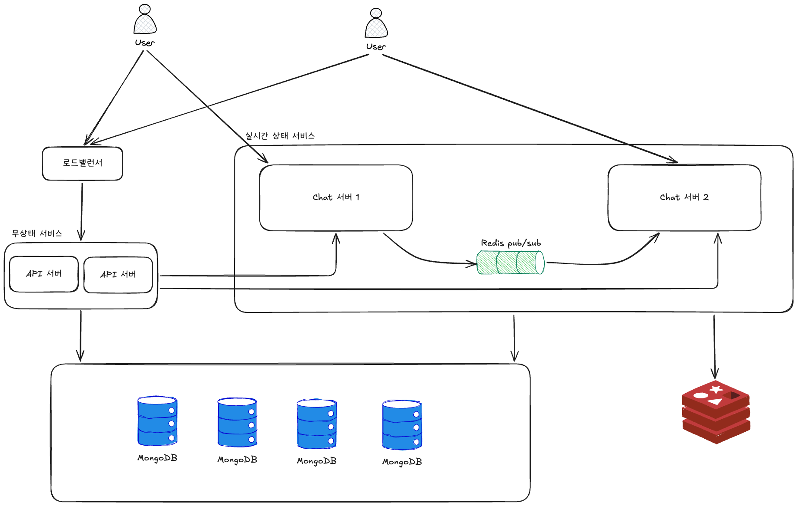
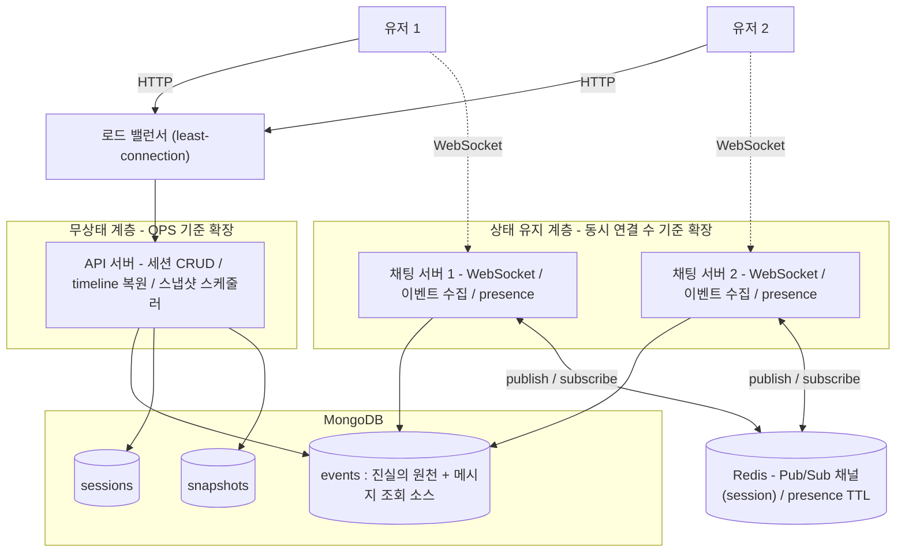

# 시스템 아키텍처

## 1. 설계 원칙

1. **정당화되지 않는 컴포넌트는 넣지 않는다.** 각 컴포넌트는 "왜 존재하는가"에 한 문장으로 답할 수 있어야 한다.
2. **진실의 원천은 하나다.** 모든 정합성·복원 논리는 `events` 컬렉션 하나로 수렴한다.
3. **MongoDB를 골랐으면 MongoDB답게.** 멀티 컬렉션 트랜잭션에 의존하지 않고, 단일 도큐먼트 원자성 위에 설계한다.

검토했으나 채택하지 않은 것:

| 후보 | 뺀 이유 |
|---|---|
| Kafka | 라이브 전달엔 컨슈머 그룹의 분담 모델이 브로드캐스트 요구와 상반. 비동기 파이프라인용으론 단일 컬렉션 구조라 분리할 작업이 없음 |
| 별도 읽기 모델 컬렉션(`messages`) | `events`에서 `type` 인덱스로 메시지 직접 조회. 별도 컬렉션은 멀티 도큐먼트 트랜잭션을 요구 |
| 별도 ID 생성기 서비스 | UUIDv7을 채팅 서버 인메모리에서 생성 — 원격 호출·단일 장애점 회피 |
| 별도 Presence 서버 | WebSocket 연결 자체가 presence 신호. 연결을 가진 채팅 서버가 직접 처리 |

남은 외부 시스템은 **MongoDB와 Redis 둘뿐**이다.

## 2. 기술 스택과 선택 근거

| 영역 | 선택 | 근거 |
|---|---|---|
| 실시간 전송 | WebSocket (STOMP) | 양방향 지속 연결. SSE는 단방향, long-polling은 비효율, WebRTC는 P2P라 서버 이벤트 영속화에 부적합 |
| 저장소 | MongoDB | 채팅 이벤트의 append-heavy 특성 + 수평 샤딩 빌트인 |
| 메시지 ID | UUIDv7 | 시간 정렬 가능 + 인스턴스 간 조율 불필요 |
| 라이브 전달 | Redis Pub/Sub | 채널 = `session_id`. 구독/발행 모델이 "수신자 위치를 몰라도 전달"을 해결 |
| presence / 캐시 | Redis (TTL) | 휘발성 접속 상태에 적합 |

### 2.1 저장소 — MySQL 대비 MongoDB

채팅 이벤트는 끊임없이 쌓이는 append-heavy 데이터다. `events`는 시간이 지날수록 무한히 커진다. MongoDB의 실질 이점은 **수평 샤딩이 빌트인**이라는 점 — shard key를 정하면 `mongos` 라우터가 분산·재배치를 자동 처리한다. MySQL은 네이티브 샤딩이 없어 애플리케이션 레벨 라우팅이나 Vitess 같은 별도 계층이 필요하다.

> **솔직한 트레이드오프**: MongoDB의 샤딩 이점은 데이터가 단일 노드 용량을 넘는 대규모에서 발동한다. 본 과제 범위(1:1, 소규모)에서는 단일 인스턴스로 충분하다. 그럼에도 MongoDB를 택한 이유는 (1) 채팅 이벤트의 성장 특성상 확장 경로를 처음부터 단순하게 두는 게 합리적이고, (2) 단일 컬렉션 설계로 MongoDB의 약점(멀티 도큐먼트 트랜잭션)을 회피하기 때문이다.

### 2.2 메시지 ID — Snowflake 대비 UUIDv7

UUIDv7과 Snowflake는 둘 다 앞부분에 밀리초 타임스탬프를 담아 ID 자체로 시간순 정렬이 된다. 차이:

| 기준 | Snowflake | **UUIDv7 (채택)** |
|---|---|---|
| 인스턴스 간 조율 | 워커ID를 인스턴스마다 유일하게 배분해야 함 | 불필요 |
| 표준·생태계 | 비표준, 직접 구현 | RFC 9562 표준 |
| 크기 | 64bit (작음) | 128bit |

Snowflake의 유일한 실질 장점인 작은 크기는 대규모 인덱스 압박에서 발동하는 이점이고, 워커ID 배분 부담은 규모와 무관하게 항상 발생한다. 발동하지 않는 장점을 위해 실재하는 비용을 지불하지 않는다 — UUIDv7 채택. 구현은 [java-uuid-generator(JUG)](https://github.com/cowtowncoder/java-uuid-generator) 라이브러리를 사용해 같은 ms 내 monotonic 단조성까지 확보했다.

### 2.3 라이브 전달 — Kafka 대비 Redis Pub/Sub

정확한 구분 축은 **메시지의 수명**이다.
- **Redis Pub/Sub = 전달 통로**: 메시지를 저장하지 않는다. 발행 순간 구독 중인 소켓에 밀고 끝.
- **Kafka = 영속 로그**: 디스크에 보관하고 오프셋을 추적한다.

라이브 전달은 "지금 연결된 상대에게 한 번 푸시"하면 끝나는 성격이고, 유실되어도 수신자가 재접속 시 MongoDB에서 복구한다. 이는 전달 통로의 일이지 영속 로그의 일이 아니다. 또한 라이브 전달은 모든 채팅 서버가 전체 이벤트를 봐야 하는 브로드캐스트인데, Kafka 컨슈머 그룹은 파티션을 멤버끼리 나눠 갖는 분담 모델이라 상반된다. 상세: [실시간 라이브 전달](../reports/realtime-delivery.md).

## 3. 전체 아키텍처

시스템은 **무상태 계층(API 서버)**과 **상태 유지 계층(채팅 서버)**으로 나뉘고, 외부 서비스는 **MongoDB와 Redis** 둘이다.

한 문장으로 흐르는 동작 — 클라이언트는 세션 생성·복원 같은 일반 요청은 HTTP로 API 서버에, 실시간 메시지는 WebSocket으로 채팅 서버에 보낸다. 채팅 서버는 받은 이벤트를 MongoDB `events`에 저장하고, 같은 세션의 상대에게 전달하기 위해 Redis Pub/Sub의 세션 채널로 발행한다. 상대가 어느 채팅 서버에 붙어 있든 그 채널을 구독 중이므로 메시지를 받아 자기 WebSocket으로 push한다. 데이터 정합성의 모든 책임은 MongoDB `events`로 수렴하고, Redis는 휘발돼도 되는 것(전달 채널·presence)만 담당한다.

## 4. 컴포넌트 역할

| 컴포넌트 | 상태성 | 역할 |
|---|---|---|
| API 서버 | 무상태 | 세션 생성/종료/목록, 특정 시점 복원(timeline), 스냅샷 스케줄러 |
| 채팅 서버 | 상태 유지 | WebSocket 연결·heartbeat, 이벤트 수집→MongoDB 저장→ACK, Redis Pub/Sub 발행·구독, presence 관리 |
| MongoDB | — | `events`(진실의 원천), `sessions`, `snapshots` |
| Redis | — | 세션별 Pub/Sub 채널(라이브 전달), presence(TTL) |

## 5. 통신 계층 — API 서버와 채팅 서버의 경계

통신은 시간순으로 두 단계로 갈린다.

- **연결 맺기 전 (HTTP, API 서버 경유)** — 세션 생성, 목록 조회, 특정 시점 복원. 요청-응답 한 번으로 끝나는 일.
- **연결 맺은 후 (WebSocket, 채팅 서버 직결)** — 메시지 송신·수신, heartbeat. 메시지는 API 서버를 거치지 않고 지속 연결로 채팅 서버와 직접 주고받는다.

한 클라이언트가 채팅 서버와 WebSocket을, API 서버와 HTTP를 동시에 들고 있는 것이 정상이다.

## 6. 모듈 구성

멀티모듈 — 무상태 계층/상태 유지 계층은 성질이 다르고 독립적으로 확장되므로 빌드·배포 단위를 분리한다.

| 모듈 | 역할 | 인스턴스 수 |
|---|---|---|
| `common` | 공유 도메인 모델 · 이벤트 정의 · 영속 스키마(`@Document`) · 공통 응용 서비스 | 라이브러리 |
| `api-server` | 무상태 — 세션 CRUD, timeline 복원, 스냅샷 스케줄러 | 1 (단순 증설 가능) |
| `chat-server` | 상태 유지 — WebSocket·이벤트 수집·라이브 전달·presence | **여러 개** (수평 확장의 핵심 단위) |

> **DDD 레이어드 적용** — `domain`(순수 도메인, 프레임워크 무의존) → `application`(유스케이스) → `presentation`(Controller·STOMP) / `infrastructure`(Repository 구현·`@Document`). Repository는 domain이 인터페이스로 정의하고 구현은 각 서버 모듈의 `infrastructure`에 둔다(의존성 역전). 영속 모델(`@Document`)과 도메인 객체는 분리한다.

**Docker Compose 구성** — `api-server` ×1, `chat-server-1`, `chat-server-2`, `mongodb`, `redis`. 채팅 서버를 2개 띄우는 이유는 "서로 다른 서버에 붙은 두 유저" 시나리오와 서버 장애 복구를 로컬에서 재현하기 위함이다. 로드 밸런서·알림 서버·Redis Sentinel HA는 인프라/운영 계층이라 설계 문서에만 두고 로컬 Compose에는 포함하지 않는다.

## 7. 확장 경로

| 계층 | 확장 기준 | 전략 |
|---|---|---|
| API 서버 | QPS | 무상태 → 로드밸런서 뒤 단순 증설 |
| 채팅 서버 | 동시 연결 수 | least-connection 분산. 서버 간 전달은 Redis 세션 채널이 중계하므로 서버끼리 서로 몰라도 됨 |
| MongoDB | 데이터량·쓰기 부하 | `events`를 `session_id` shard key로 샤딩 |
| Redis | 처리량·채널 수 | 클러스터 모드 — 단 Pub/Sub fan-out은 단일 노드 병목이 확장 천장 |

확장의 진짜 천장은 MongoDB가 아니라 **Redis Pub/Sub의 단일 노드 fan-out**이다. 상세: [수평 확장 전략](../reports/scalability.md).
