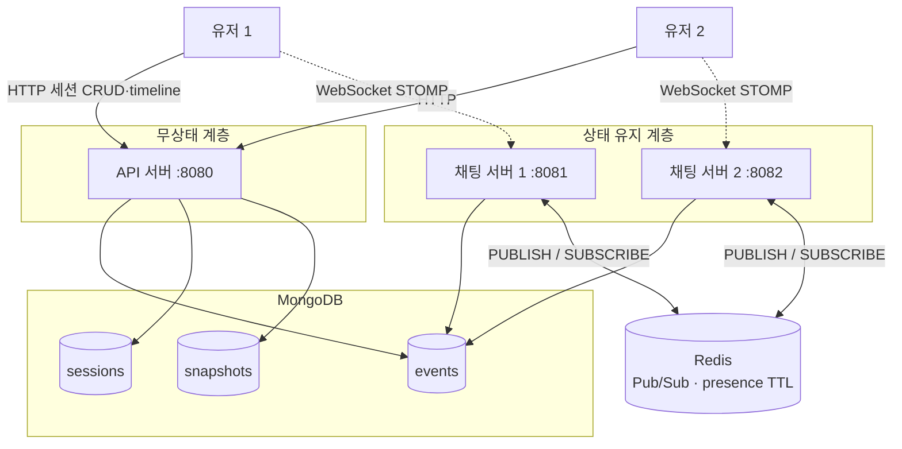
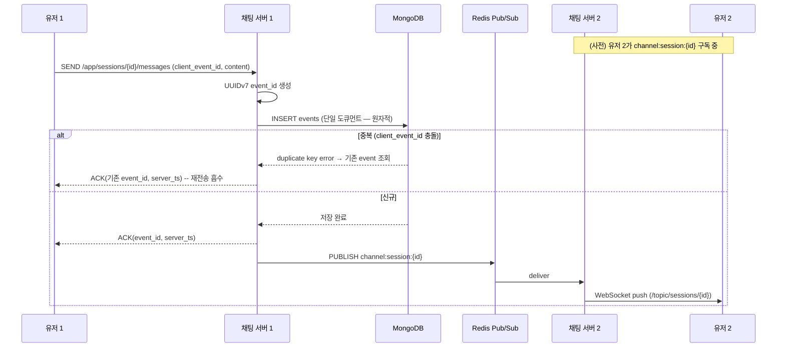
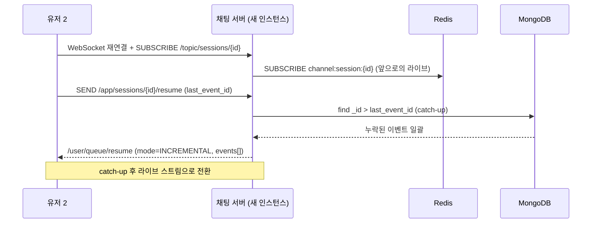
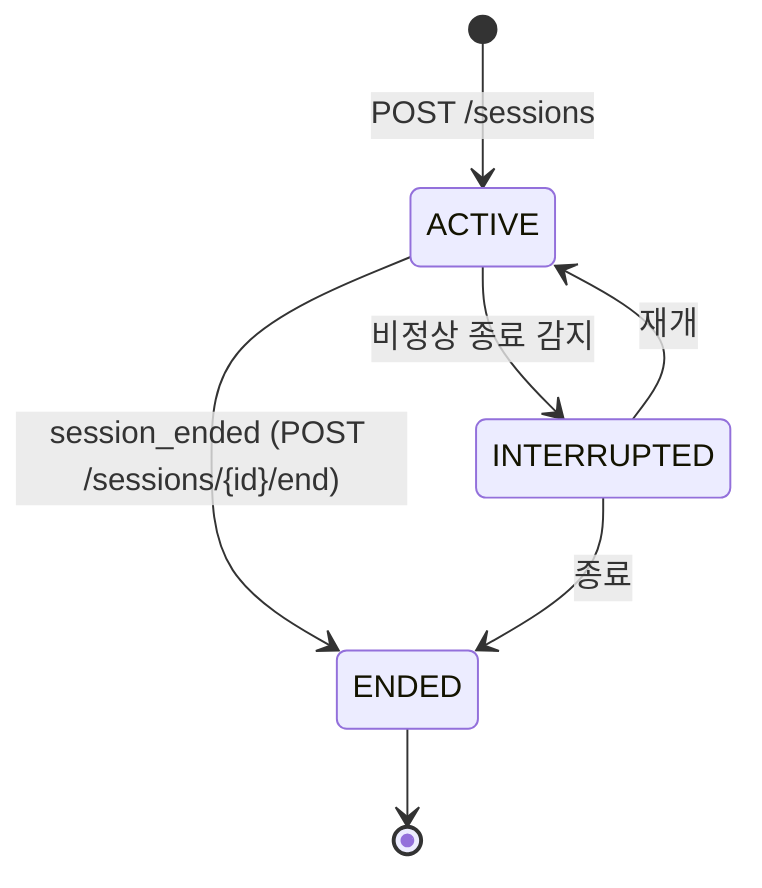
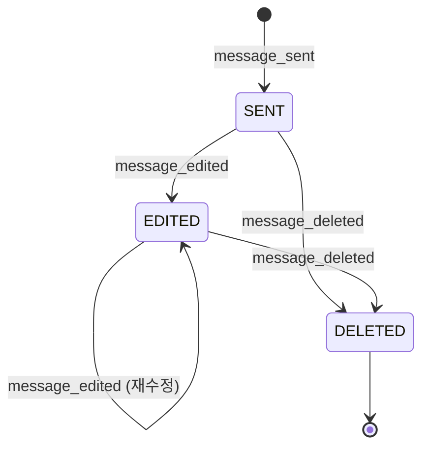
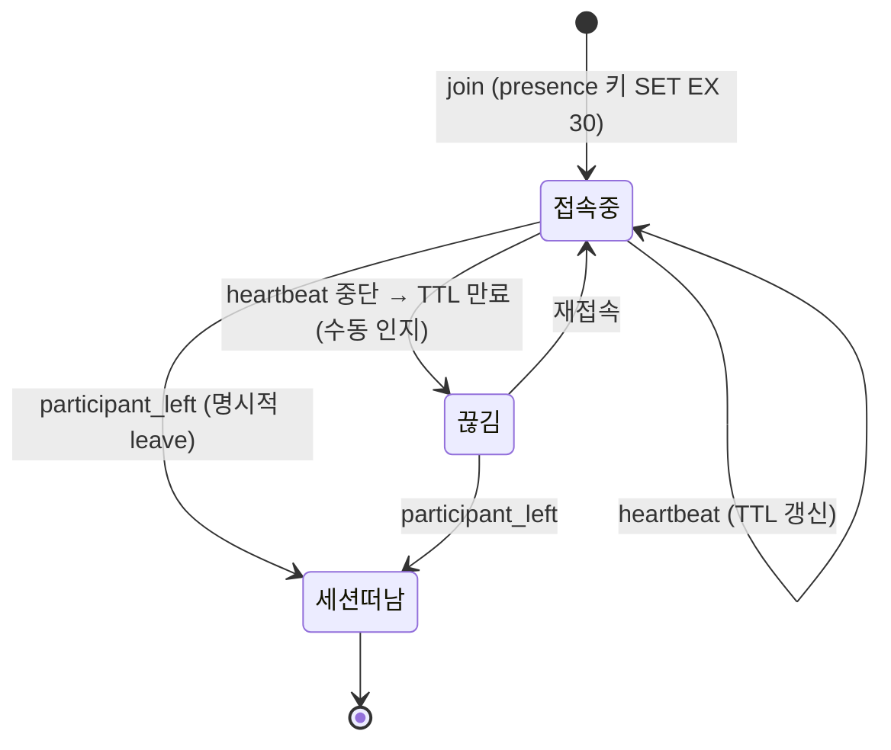

# 다이어그램

## 1. 컴포넌트 다이어그램

## 2. 시퀀스 — 메시지 송신 (서로 다른 채팅 서버)

설계서 §8.1. 유저 1은 채팅 서버 1, 유저 2는 채팅 서버 2에 붙어 있다.

ACK는 "MongoDB에 저장됐다"는 의미이며 "상대가 봤다"는 의미가 아니다. MongoDB 저장 성공 이후의 Redis 발행은 best-effort다.

## 3. 시퀀스 — 재연결 resume (Pull 복구)

설계서 §9.3. 채팅 서버 장애 또는 네트워크 단절 후.

`last_event_id`가 없거나 catch-up 대상이 임계치를 초과하면 `mode=SNAPSHOT`으로 전환 — 스냅샷 기반 현재 상태 + 새 `last_event_id`를 내려준다.

## 4. 상태 다이어그램 — 세션 수명주기

`INTERRUPTED`는 `ACTIVE`였던 세션이 비정상 종료로 감지된 상태다. 세션 상태(`status`)는 `sessions` 컬렉션의 메타데이터이며, 참여자 목록은 `events`의 `participant_joined`/`participant_left`로 별도 계산된다.

## 5. 상태 다이어그램 — 메시지 상태 (이벤트 소싱 리듀서)

설계서 §10.2. 메시지는 도큐먼트를 수정하지 않고 `message_edited`/`message_deleted` 이벤트를 새로 추가한다.

`DELETED`는 soft-delete — 본문은 보존하고 status만 바꾼다. 리듀서는 `target_event_id`가 현재 상태에 없으면 no-op 처리해, 수정/삭제 이벤트가 원본보다 먼저 도착해도 깨지지 않는다.

## 6. presence 상태 (세션 참여/접속)

설계서 §8.3. 한 세션 안에서 상대의 상태는 셋으로 구분된다.

`접속중`/`끊김`은 presence(Redis TTL)로, `세션떠남`은 `participant_left` 이벤트로 판정한다. 멤버십과 접속 여부는 독립적이다 — 멤버이면서 끊겨 있을 수 있다.
